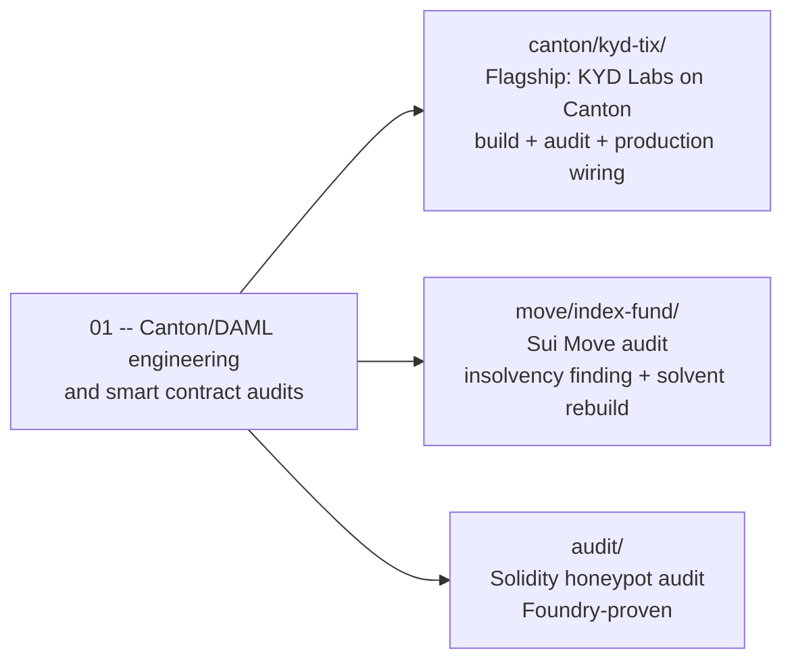

# 01 — Canton/DAML engineering & smart contract audits

Zero Labs builds and audits smart contract systems across ecosystems. This
repo is the public portfolio. The flagship is a complete, audited,
production-shaped **Canton Network application**; the rest is audit work on
Sui Move and Solidity.

---

## Flagship: KYD Labs on Canton — [`canton/kyd-tix/`](canton/kyd-tix/)

A from-scratch migration of [KYD Labs](https://kydlabs.com/) (the largest
on-chain ticketing company) from Solana to **Canton/DAML** — ticketing
(TICKS), revenue-based event financing (TIX), and the full product on top.
Built to demonstrate the difference between *writing Daml that compiles* and
*engineering for Canton*:

- **Contention engineering** — cold-master/hot-shard issuance, create-only
  settlement receipts, batch sweeps: one loan write per batch instead of per
  ticket, N parallel sales streams per event, a key-free hot path. The
  README's hot-path analysis table maps each naive design to its Canton
  failure mode and the fix.
- **Audited, with the receipts** — [`AUDIT.md`](canton/kyd-tix/AUDIT.md):
  trust-model table, findings KYD-01..11 (six HIGH/MEDIUM authority and
  custody bugs found in our own code and fixed — including the operator
  rewriting the lender register, and later a deeper one where the same
  operator could redirect *any* locked holding to itself), and a **12-suite
  adversarial harness where every scenario is an attack that must fail**. 35
  scenarios in CI, zero warnings, divulgence-free by construction.
- **Production-wired, not just modeled** — [`server/`](canton/kyd-tix/server/)
  is a real auth/catalog/payments backend: RS256-signed session tokens,
  Daml User provisioning, HMAC-verified webhook minting — with a live proof
  ([`server/auth-proof/`](canton/kyd-tix/server/auth-proof/)) that a real
  Canton participant, not just this repo's own tests, verifies the
  signatures and authorizes a real login end to end.
- **Ecosystem-real** — settles DvP through the vendored **CIP-56 token
  standard interfaces** (Canton Coin / USDCx compatible), SCU-ready at
  LF 1.17, with a [validator + Featured App operations plan](canton/kyd-tix/validator/)
  grounded in the post-April-2026 incentive economics.
- **The whole product** — operator automation (Daml Triggers), JSON API +
  typed TS bindings, a PWA web app (wallet, one-tap buys, QR passes, capped
  resale, gifting, door scanner, venue financing dashboard), a native SwiftUI
  iOS app, one-command demo (`make demo`), CI, and a
  [HANDOFF.md](canton/kyd-tix/HANDOFF.md) that says plainly what is verified
  and what is scaffolded.

---

## Auditing Canton applications

Daml's authorization model eliminates whole bug classes — and introduces its
own. Generic EVM audit checklists miss them. What we examine, each item
demonstrated in this repo's flagship:

| Surface | The Canton-specific failure mode | Demonstrated by |
| --- | --- | --- |
| **Authority & controllers** | A choice controller with more power than the workflow needs (our KYD-01: operator-only controller could rewrite a lender register with no offer, no payment) | Finding + fix + `testRegisterIntegrity` |
| **Privacy & divulgence** | Escrows leaking via deprecated divulgence; observer lists wider than intended | Explicit-disclosure escrow pattern; warning-free suite |
| **Contract keys** | Key uniqueness silently unenforceable across sync domains; keys on hot templates | Key-free hot path; keys only on cold admin contracts |
| **Contention / liveness** | Consuming choices on shared contracts = serialized throughput and retry storms under load (a DoS you build yourself) | Shard + receipt + batch-sweep architecture |
| **Custody & trust model** | "Who can take the money" mapped per party, including the operator — a lock-in-place primitive can look safe while the *release* choice is still unilaterally operator-controlled (our KYD-11) | Trust-model table; joint-controller refunds; CIP-56 registry custody; lock-recipient + co-signer binding on every settlement |
| **Upgrade safety (SCU)** | Interfaces co-packaged with implementations; non-append schema changes | Separate interface package; LF 1.17 build |
| **Economic logic** | Rounding drift in pro-rata waterfalls; price-curve bypasses; royalty/cap evasion paths | Exact telescoping allocation; adversarial price/cap/refund suites |

The deliverable looks like [`canton/kyd-tix/AUDIT.md`](canton/kyd-tix/AUDIT.md):
every finding tied to an **executable** attack scenario, severities argued,
accepted risks documented instead of hidden.

---

## Other audit work in this repo

- **Sui Move** — insolvency audit of a crypto index fund (a pool that pays out
  a notional basket while only ever holding SUI) plus a solvent, tested
  pro-rata rebuild: [`move/index-fund/`](move/index-fund/).
- **Solidity** — honeypot taxonomy: line-by-line teardown of a trap-laden
  memecoin template with runnable Foundry proofs, alongside a trap-free
  reference token: [`AUDIT.md`](AUDIT.md), [`audit/`](audit/) (`forge test`).

---

## Working with us

Engagements: Canton/DAML application audits, Canton application architecture
(contention, privacy, tokenomics/CIP-56 integration), and full-stack builds
like the flagship above. Open an issue here or reach out directly.
