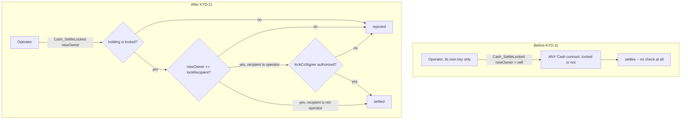

# Security review — kyd-tix (TICKS + TIX on Canton)

Self-audit of the Daml model in `daml/`, written against the authorization,
privacy and contention semantics of Daml 2.10 / Canton. Every claim below is
backed by an executable adversarial scenario in `daml/Kyd/SecurityTest.daml`
(12 attack suites) or the functional suites (`Kyd.Test`, `Kyd.TokenTest`).
The full suite runs warning-free: divulgence-free by construction, not by
suppression. **All HIGH and MEDIUM findings (KYD-01, -02, -08, -09, -10, -11)
are fixed/resolved**; the remaining items are LOW/INFO (by-design or
accepted).

## Trust model

| Party | Powers | Bounded by |
| --- | --- | --- |
| **Operator** (KYD platform) | Issues `Cash` (it is an IOU on the operator); fills purchase orders; runs sweep/accrual automation; co-signs tranche trades and receipt refunds | Cannot move owner-held cash, freeze a holding without its owner's consent (KYD-11), redirect a locked holding anywhere but its declared recipient (KYD-11), comp-issue tickets, reprice, rewrite the lender register (KYD-01), or refund escrow unilaterally |
| **Venue** | Opens allocations; raises financing; distributes repayments; *co-signs* comps and repricing with the operator | Cannot self-fill paid orders, touch the carved-out financing share, refund escrow unilaterally, comp/reprice without the operator (KYD-08), or burn tickets early — check-in is bounded to a doors window (KYD-10) |
| **Artist** | Co-signs events; repricing; receives royalties | Cannot issue, spend, or alter financing |
| **Fan** | Signs purchase orders (authorizing exactly one payment); owns tickets | Resale gated by price cap; redeemed tickets non-transferable |
| **Lender** | Commits/uncommits to raises; trades tranches; receives waterfall payments | KYC-gated (membership); cannot touch tickets, events, or other lenders' positions |

## Findings

### KYD-01 — Operator could unilaterally rewrite the lender register (HIGH, fixed)

`Loan_ExecuteTrancheTransfer` had `controller operator`. Since the operator is
a loan signatory, it could move any lender's tranche to any party with no
offer and no payment. The only legitimate call site (`TrancheOffer_Accept`)
already carries the seller's authority via the offer the seller signed, so the
choice now requires `controller operator, seller` — the capability is removed
at zero cost to the workflow.
Verified by `testRegisterIntegrity`.

### KYD-02 — Escrow custody (MEDIUM, resolved)

Originally, pending revenue shares and financing commitments were held as
operator-owned `Cash` — funds in operator custody while pending, with the
signed receipt as the holder's only claim. **Resolved** by moving every escrow
to lock-in-place custody: funds stay owned by their holder (the venue for
revenue shares, the lender for commitments) and the registry (operator) only
holds a `Cash` lock, so the funds cannot be spent while reserved but custody
never transfers to the operator. The operator can no longer abscond with a
pending share or commitment — there is nothing operator-owned to abscond with.
Verified by `testCommittedFundsLockedInPlace` (a committed note stays
lender-owned and is unspendable), `testCip56LockReservation` (allocations lock
in place), and `testReceiptCustody` (refund needs operator AND venue; the venue
cannot release).
Lock-in-place introduces one new risk — a stuck/malicious operator never
releasing a lock — which is closed by **expirable locks**: commitment locks
carry the offering's due date as `expiresAt`, and `Cash_UnlockExpired` lets the
holder reclaim unilaterally once it passes (CIP-56's expired-lock guidance).
Verified by `testCommitmentExpiryReclaim`.
The residual issuer risk (all `Kyd.Cash` is an operator IOU) is closed by the
production swap to Canton Coin / USDCx — a `Kyd.Registry` dependency change,
since all settlement speaks only the CIP-56 interfaces (see
`validator/README.md`).

### KYD-03 — Batch settlement delays lender receipt (LOW, by design)

Receipts reach lenders on the sweep cadence (minutes), not per sale. This is
the deliberate contention trade (one loan write per batch instead of per
ticket; see README "Canton engineering"). The venue can never touch the share
in the interim, so the delay is liquidity timing, not credit risk.
Verified by `testBatchSweep` and `testPaidPrimarySaleRoutesRevenue`.

### KYD-04 — Refunded escrow retains disclosure (INFO, acknowledged)

`Offering_Cancel` refunds lender escrows without clearing the `Cash`
disclosure list (the venue remains an observer of the refunded note until the
lender re-discloses or transfers). `Offering_Uncommit` and activation DO clear
it. Impact: transient read-only visibility of one note's balance; the owner
can clear it at will via `Cash_Disclose []`.

### KYD-05 — Step-pricing granularity is venue-controlled (INFO)

The demand curve advances per allocation, not per ticket. A venue opening one
huge shard flattens the curve for that block. This is a policy knob (shard
size), not a vulnerability — the curve parameters themselves are tamper-proof
(signed by operator+venue+artist on the master).

### KYD-06 — Divulgence eliminated (resolved during development)

Early escrow flows relied on contract divulgence (deprecated on Canton,
incompatible with pruning). All escrow visibility is now explicit via the
`Cash.observers` disclosure list; the suite runs with zero divulgence
warnings.

### KYD-07 — Gifts carry no royalty (INFO, accepted)

`Ticket_OfferGift` moves a ticket with no on-ledger payment, so no royalty or
cap applies — the classic "gift + off-ledger side-payment" resale loophole.
Accepted deliberately: gifting is a core fan behavior, and blocking it costs
more than the leak (side-payments also evade *any* on-chain rule). Mitigation
belongs in the app layer (rate limits, identity, gift-graph anomaly
detection), where KYD already operates. The consent flow (propose/accept) and
redeemed-ticket guard are enforced on-ledger.
Verified by `testGiftFlow` and `testGiftAndRefundSecurity`.

### KYD-08 — A financed venue could starve its lenders (HIGH, fixed)

TIX's whole premise is that *ticket revenue automatically enforces repayment* —
each paid sale carves a `RevenueShare` for the syndicate. But the venue
controlled three issuance levers **unilaterally**, each a way to route around
that capture:

1. **Comp the house** — `Allocation_Issue` mints tickets with **no**
   revenue-share carve-out. A venue that had raised TIX financing could comp its
   entire inventory and sell it off-ledger, so zero revenue ever reached the
   loan.
2. **Reprice to ~0** — `Allocation_Reprice` set a shard's price to `0.01`, so
   paid sales carve almost nothing.
3. **Drop the tier base price** — `Event_SetTierBasePrice`, same effect at the
   policy level.

None of these required operator dishonesty — the *venue* could defeat the core
value proposition and leave lenders holding an (only late-interest-enforced)
maturity claim. **Fixed** by requiring the operator — the lenders' agent — to
co-sign every issuance economics lever: `Allocation_Issue`,
`Allocation_Reprice` and `Event_SetTierBasePrice` are now jointly controlled by
`operator` and the venue/artist. The platform can therefore hold a financed
venue's comps and price changes to the financing terms. Paid sales (the hot
path) are unchanged. The residual off-ledger-resale-of-comps risk is the same
class as KYD-07 and is an app-layer control.
Verified by `testFinancedVenueCannotStarveLenders` (venue/artist alone cannot
comp or reprice; the operator co-signed path works).

### KYD-09 — Open order book leaked committed lenders (MEDIUM, fixed)

The open raise was a single `OpenFinancingOffering` observed by the `public`
party, with the `commitments` list (each lender's identity and amount) on the
same contract — so any participant reading the public book saw **who** committed
and **how much**, a confidentiality concern for syndicated credit. **Fixed** by
splitting discovery from the commitment ledger: `OpenOfferingListing` (observed
by `public`) carries only the terms and the aggregate `raised`, while each
lender's commitment is a separate, private `OpenCommitment` (signatory operator
+ lender, observer venue) the public party never sees. Activation gathers the
private commitments. The targeted `FinancingOffering` is unchanged (its
observers are the invited lenders only).
Verified by `testOpenOrderBook` (the public party's `OpenCommitment` query is
empty; each lender sees only its own; the aggregate is the only public figure).

### KYD-10 — Venue could redeem tickets unilaterally, anytime (MEDIUM, fixed)

`Ticket_CheckIn` was `controller venue` with no time bound, so a venue (or a
compromised venue key) could mark any outstanding ticket `redeemed` **before
the event**, destroying its resale value and griefing fans. **Fixed** by
denormalizing `eventTime` onto `TierAllocation` and `Ticket` (no new module
dependency / import cycle) and bounding check-in to a doors window: check-in is
rejected unless `now` is within `doorsOpen` (12h) of showtime, so tickets
cannot be burned days early. The door scanner in the app still works (the demo
seed dates its checkable show "tonight").
Verified by `testEarlyCheckInBlocked` (months-early check-in rejected; the same
scan succeeds at showtime).

### KYD-11 — Lock-in-place custody was enforceable only against the owner, not the operator (HIGH, fixed)

KYD-02 resolved custody by locking funds in place rather than moving them to
operator ownership — but the primitive that *releases* a lock,
`Cash_SettleLocked`, was `controller operator` alone, with an unconstrained
`newOwner` parameter and no check that the holding was even locked. Because
this choice lives on `Cash` (issuer-signed by the operator only — no other
party's signature to draw on), it was independently exercisable by the
operator on **any** `Cash` contract id it could read, standalone, bypassing
every higher-level wrapper (`Receipt_Release`, `settleCommitmentToVenue`,
`OpenCommitment_SettleToVenue`, the CIP-56 `Allocation`'s execute path). In
practice this meant the operator, holding nothing but its own key, could:

1. **Steal any note outright** — `Cash_SettleLocked` never checked the
   holding was locked, so it worked identically on a fan's, artist's, or
   venue's plain spendable balance.
2. **Freeze arbitrary funds** — `Cash_Lock` was also `controller operator`
   alone, so a lock (step 1's prerequisite, if we'd merely added an
   is-locked check) could be created on any party's cash without their
   consent.
3. **Redirect a legitimately locked holding to itself** — even for holdings
   locked through a real workflow (a lender's financing commitment, a CIP-56
   DvP allocation), `newOwner` was a free parameter, so the operator could
   settle the lock to itself instead of the venue or the true receiver.
4. **Take custody of a revenue-share receipt and simply keep it** — the one
   case where operator custody *is* legitimate (the revenue-share fan-out
   hop before `Loan_SweepRevenue` pays lenders pro rata), `Receipt_Release`'s
   `controller operator` meant the operator could call it as its own
   standalone transaction, archive the receipt, and never continue to the
   waterfall — no on-ledger obligation survives to force the payout.

This defeated lock-in-place custody's whole premise: a lock only restrains
the *owner*; nothing previously restrained the *operator*, the party who
actually holds every lock in the system. **Fixed** with two `Cash` fields set
when a lock is created and enforced when it is released: `lockRecipient`
(the only party `Cash_SettleLocked` may hand the note to — closes items 1
and 3, and via `Cash_Lock` now requiring `controller operator, owner`, item
2) and `lockCoSigner` (an extra required controller, used only where the
declared recipient is the operator itself — closes item 4, since
`Loan_SweepRevenue` still runs under operator authority alone by inheriting
the venue's authority from `SyndicatedLoan`'s own signatories, while a
standalone call needs the venue live). `Receipt_Release` is now
`controller operator, venue` for the same reason, closing the wrapper-level
route in addition to the direct one.

Verified by `testLockedFundsCustody`: a never-locked note cannot be settled;
the operator cannot lock Alice's cash without her; a locked commitment
cannot be redirected to the operator (only ever to its true venue); the
operator alone cannot release or bypass-settle a revenue-share receipt
(needs venue); every legitimate route (the async lock → later unilateral
venue settlement; the operator+venue sweep) still works unchanged.

## Attack coverage (`daml/Kyd/SecurityTest.daml`)

| Suite | Attacks proven impossible |
| --- | --- |
| `testCashSecurity` | Forged issuance; third-party/operator theft of owner cash; overdraft splits; cross-owner merges |
| `testIssuanceAuthorization` | Non-venue allocation opening; comp-minting or repricing by operator/venue/artist *alone* (both required, KYD-08); venue self-filling paid orders |
| `testFinancedVenueCannotStarveLenders` | A financed venue comping the house or repricing to ~0 unilaterally (KYD-08) — all three economic levers blocked without the operator |
| `testReceiptCustody` | Unilateral refund by venue or operator; venue exercising release |
| `testLockedFundsCustody` | Operator settling a never-locked note (KYD-11); freezing a party's cash without consent; redirecting a locked commitment or revenue-share receipt to itself instead of its declared recipient; bypassing `Receipt_Release` via a direct `Cash_SettleLocked` call |
| `testRegisterIntegrity` | Operator rewriting the register alone (KYD-01); phantom sellers; buyer withdrawing a seller's offer; seller accepting for the buyer |
| `testForeignReceiptRejected` | Sweeping one event's receipts through another event's loan |
| `testResaleSecurity` | Double-listing a ticket; third party accepting an offer; paying with another's note or short amount; non-venue check-in; double check-in |
| `testRoleForgery` | Self-issued memberships; accepting another party's invitation |
| `testEarlyCheckInBlocked` | A venue burning a ticket days early to kill its resale value (KYD-10) — check-in bounded to the doors window |
| `testGiftAndRefundSecurity` | Non-owner gifting; self-gifts; third-party gift acceptance; fan self-refunds; wrong-amount refunds; refunding/gifting redeemed tickets |

## Residual assumptions

1. The operator runs the automation honestly and promptly (sweeps, fills,
   accrual). Failure mode is liveness, not safety: nothing settles wrongly,
   things settle late. On-ledger state remains the source of truth.
2. `Cash` is a stand-in instrument. The Canton-native deployment swaps it for
   CIP-56 token-standard holdings (Canton Coin or a stablecoin registry),
   which also retires KYD-02.
3. Ledger time is Canton's (skew-bounded); late-interest accrual quantizes to
   whole days, so clock skew cannot mint partial-day interest.
