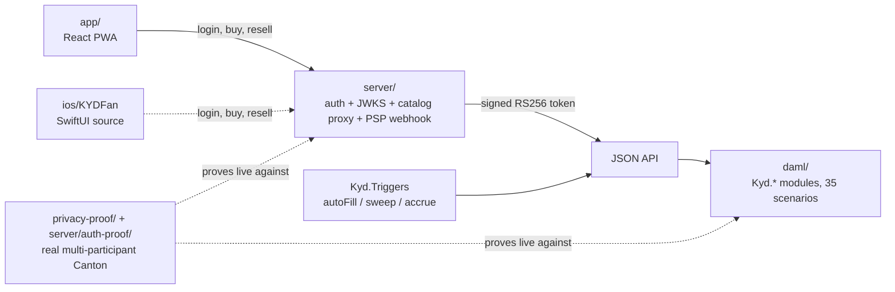

# Handoff

Everything the next engineer needs to take this from demo to production,
honestly labeled. Start here, then `README.md` for the architecture story and
`DESIGN.md` for the decision record (why each choice, and the open questions
for KYD).



The dotted edges are the two things this repo *proves against a real running
Canton*, not just tests in-memory — see `privacy-proof/README.md` and
`server/README.md`'s `auth-proof/` section.

## One-command map

```
make test        # Daml: 2 packages, 35 scenarios (functional/adversarial/CIP-56)
make server-test # auth/catalog/payments server: 26 tests, no ledger required
make app         # web app: codegen + type-check + production build
make demo        # local stack: sandbox + seed + JSON API + server + 3 triggers
                 # then: cd app && npm run dev  (web)  /  ios/KYDFan (Xcode)
```

CI (`.github/workflows/kyd-tix.yml`) runs the Daml suite and the web build on
every push touching this tree.

## What is verified, and how

| Layer | Verification |
| --- | --- |
| Daml model (`daml/`) | 35 scenarios in CI: functional + adversarial attack suites + CIP-56 interface suites + demo seed. Zero warnings (divulgence-free). |
| Contention (`integration/client/src/bench.ts`) | **Measured** on a local sandbox: sharding gives 8.7× (16 concurrent) and 13.7× (24 concurrent) throughput, contention retries 100s → 0, scaling with concurrency. `npm run bench -- N`. Not in CI (needs a running ledger). |
| Multi-participant on real Canton (`privacy-proof/`) | **Proven on a real 2-participant + 1-domain Canton network** (`./run.sh`): the `Cash` privacy primitive AND the full app (sharded issuance, paid sale, cross-participant gift) — a competing venue's node holds none of another venue's events/tickets. Race-free, deterministic. Not in CI (needs a running Canton); run on demand. |
| Web app (`app/`) | Type-check + production build in CI. The full runtime loop (JWT → catalog → split → order → trigger fill → pass; financing receipt escrowed) was driven over HTTP against the running stack during development. |
| Triggers (`Kyd.Triggers`) | Compile into the DAR; listed by the runner; fills exercised end-to-end in the runtime loop above. |
| CIP-56 integration | `Cash` implements `Holding`; `Kyd.Registry` implements the standard `TransferFactory`/`AllocationFactory`/`Allocation`. Resale + transfers tested through these real factories. NOT yet run against live Canton Coin/USDCx package ids (swap the vendored DAR for the official releases). |
| iOS app (`ios/KYDFan`) | Source-complete, no dependencies, same API contract as the verified web app — but **not compiled** (no macOS CI leg). Expect a first-build pass on a Mac. |
| Validator ops (`validator/`) | Documentation + runbook with sourced commands. No node was stood up from this repo. |
| Auth/catalog/payments server (`server/`) | **26 tests, no ledger required**: real RS256 token issuance and verification (including a genuine HTTP fetch of the JWKS endpoint), signing-key persistence across process restarts, idempotent Daml User provisioning, the login route's operator exclusion, HMAC signature accept/reject on the PSP webhook, the catalog proxy. **Plus `server/auth-proof/`** — a real, single-participant Canton configured with a `jwt-rs-256-jwks` auth-service: proves Canton's own ledger-api verifies these signatures, rejects forged/tampered/absent/unprovisioned tokens, AND — the thing an earlier run of this proof found missing — that a genuine fan login through `/auth/login` now authorizes a real ledger-api command end to end, closed by `server/src/userManagement.ts`'s Daml User provisioning. |

## Production gaps, in priority order

1. **Auth — closed.** `server/` replaces the old unsigned, browser-forged
   sandbox tokens (`app/src/api.ts`'s old `sandboxToken`, and the analogous
   spot in `ios .../LedgerClient.swift`, still unconverted) with real
   RS256-signed, short-lived tokens issued server-side
   (`server/src/tokens.ts`), verifiable against a published JWKS
   (`server/src/jwks.ts`), naming a real, provisioned Daml `User`
   (`server/src/userManagement.ts`) rather than just carrying a claim. The
   browser can no longer mint its own token for any party (including the
   operator); the operator credential lives only inside `server/`; and
   `server/auth-proof/` proves — live, against a real Canton participant
   configured with `jwt-rs-256-jwks` — that Canton itself verifies these
   signatures, rejects forged/tampered/absent/unprovisioned tokens, AND
   authorizes a genuine fan login's ordinary ledger-api command, end to end.
   Still needed for production, not config: a real IdP behind `/auth/login`
   in place of the demo's role picker, TLS everywhere, and wiring the same
   `jwt-rs-256-jwks` config into `run-local.sh`'s actual demo stack (proven
   in `auth-proof/`'s standalone Canton, not yet in the main one).
2. **Real money**: swap `Kyd.Cash` for CIP-56 holdings (Canton Coin/USDCx).
   All settlement — resale, commitments, and revenue shares — already speaks
   the standard `Holding`/`Allocation`/factory interfaces with lock-in-place
   custody (audit KYD-02, KYD-11 resolved), so this is a `Kyd.Registry`
   dependency change plus replacing the vendored interface package with the
   official DARs (one daml.yaml line).
3. **Catalog service — closed.** `GET /catalog` (`server/src/catalog.ts`)
   proxies the events/allocations read through the server's own operator
   session; the browser gets plain JSON, never an operator-scoped token.
4. **PSP on-ramp — closed.** `POST /webhooks/psp`
   (`server/src/webhook.ts`) is the real external route; the demo's
   `POST /payments/topup` (`server/src/payments.ts`) drives the identical,
   signature-checked mint path (`server/src/psp.ts`) rather than a separate
   client-side mint.
5. **Featured App wiring**: emit `FeaturedAppActivityMarker`s from the trigger
   submissions (validator/RUNBOOK.md §3 has the emission points).
6. **iOS**: first Xcode build, then swap `LedgerClient.swift`'s unsigned
   token for a real `/auth/login` call against `server/`, then push
   notifications for offers.

## Key design decisions (don't re-litigate without reading these)

- Contention architecture (cold master / hot shards, create-only receipts,
  batch sweep): README "Canton engineering" — this is why on-sales scale.
- Operator as joint controller on market clears: matches the agent-bank role;
  removing it breaks Daml visibility rules (see AUDIT.md trust model).
- Gifts carry no royalty (KYD-07): deliberate; mitigate at app layer.
- Keys only on cold contracts: Canton multi-domain cannot enforce key
  uniqueness; the hot path is key-free on purpose.

## File map

```
daml/                 the model (8 modules) + 4 test modules
splice-token-standard/ vendored CIP-56 interfaces (separate package, SCU rule)
app/                  web product (React/TS, PWA-installable)
server/               auth/catalog/payments — the custody boundary (server/README.md)
ios/KYDFan/           native fan app (SwiftUI, XcodeGen)
integration/          JSON API config, local stack script, headless client
validator/            network strategy (README) + operational runbook
AUDIT.md              trust model, findings KYD-01..11, attack coverage
```
