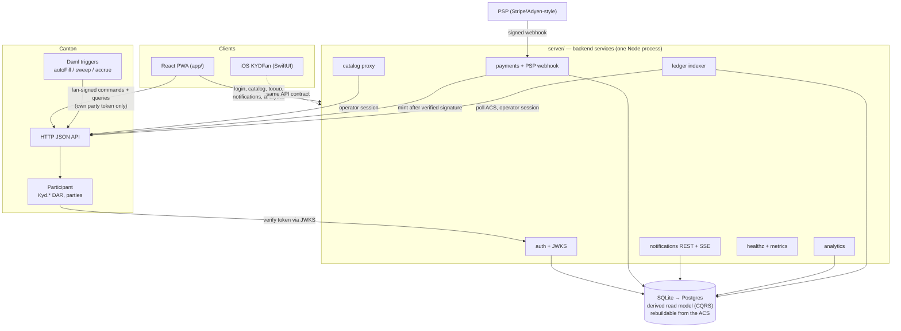
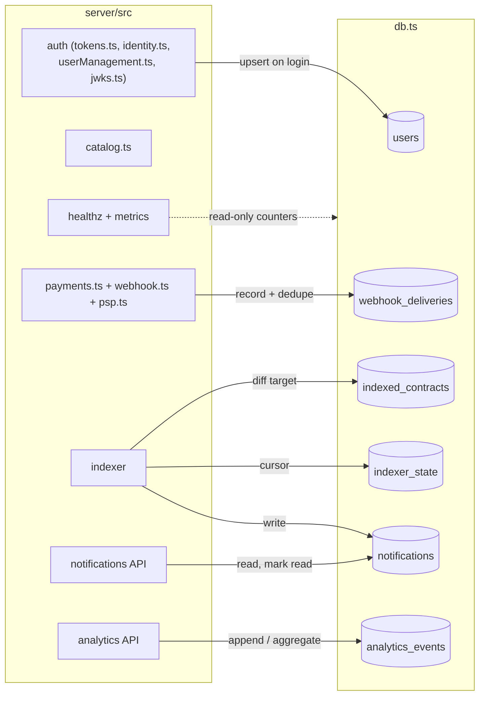
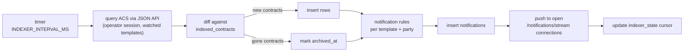
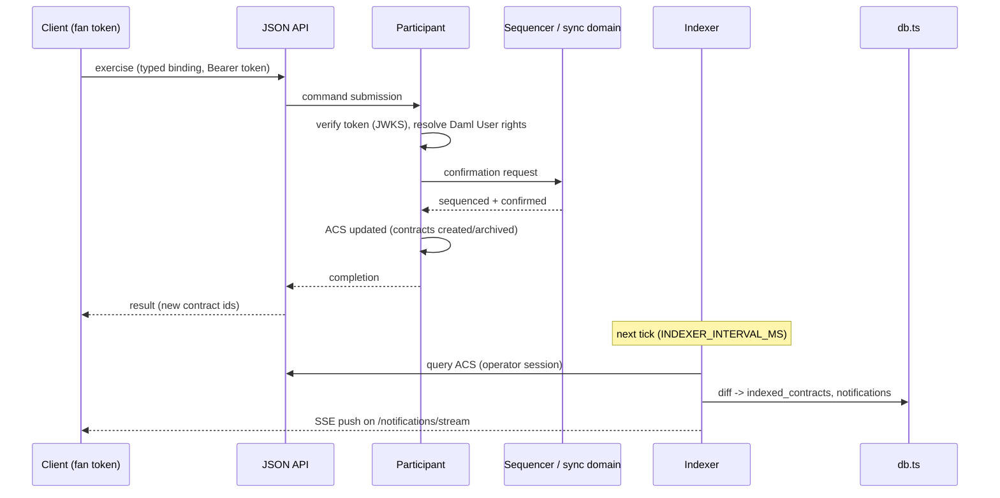
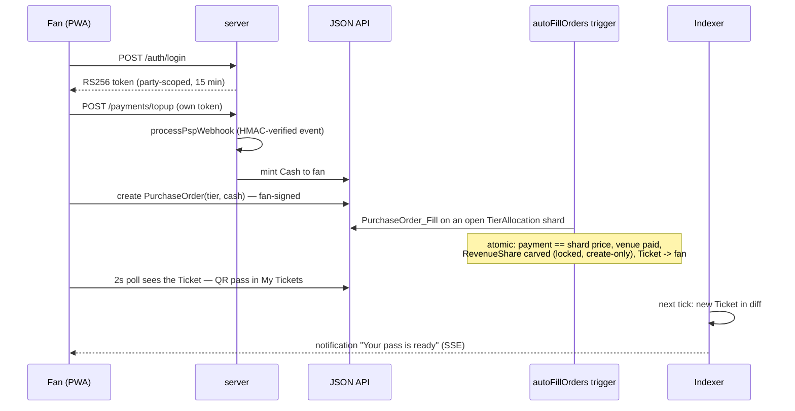
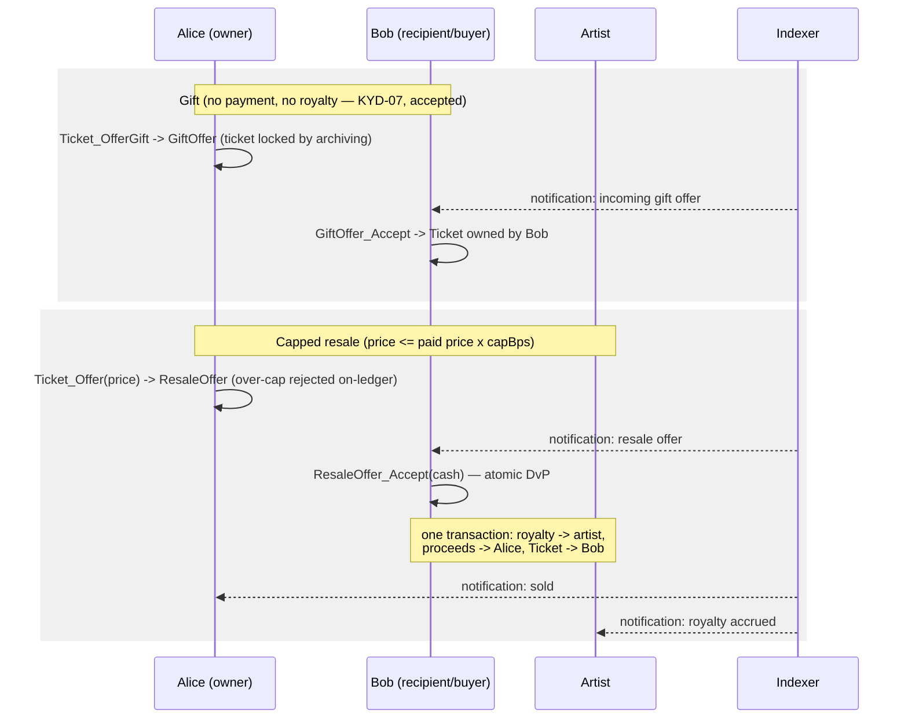
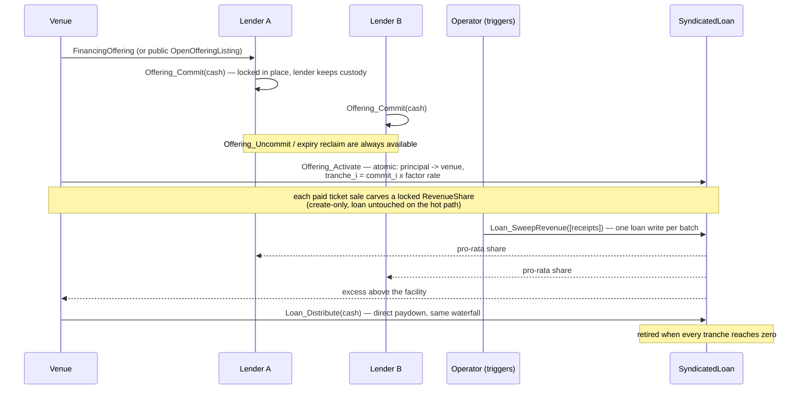

# Production architecture

How kyd-tix runs as a product, not just as a Daml model. The audited smart
contracts (`daml/`, [AUDIT.md](AUDIT.md), findings KYD-01..14, 35 CI
scenarios) are the **trusted core** — they decide who owns what and where
money moves, and nothing in this document weakens that. Everything around
them is conventional product infrastructure: a backend service tier, a
derived database, an indexer, notifications, analytics and ops endpoints.
The design rule throughout: **the ledger is the source of truth; everything
else is derived and disposable.**

Read this alongside [README.md](README.md) (the model and why it's shaped
for Canton), [HANDOFF.md](HANDOFF.md) (what's verified vs scaffolded),
[DESIGN.md](DESIGN.md) (the decision record) and
[server/README.md](server/README.md) (the custody boundary). Where something
below is aspirational rather than built, it appears only in
[§12](#12-production-roadmap).

---

## 1. System architecture

Four layers:

1. **Clients** — the React PWA (`app/`) and the native SwiftUI iOS app
   (`ios/KYDFan`). Both authenticate against the server, read the catalog
   through it, and submit fan-signed commands to the JSON API directly with
   their own party-scoped token. Neither ever holds operator authority.
2. **Backend services** (`server/`) — auth/JWKS, catalog proxy,
   payments + PSP webhook, notifications (REST + SSE), analytics, ops
   (`/healthz`, `/metrics`), and the **ledger indexer** that keeps the
   database in sync with the ACS. One Node process; one place the operator
   credential exists.
3. **Data stores** — a SQLite file today (`server/src/db.ts`), Postgres
   later (§3), **and the ledger itself**. The split matters:
   - The **ledger is the source of truth** for ownership and money —
     tickets, cash, escrows, loans. No database row ever asserts who owns a
     ticket.
   - The **database is a derived read model** (CQRS): an index of ledger
     state plus product-only data the ledger has no business holding
     (notification read-state, analytics events, webhook receipts). Drop
     the database and the indexer rebuilds the ledger-derived tables from
     the ACS on the next sync; only product-side convenience state is lost.
4. **Canton** — the participant hosting the parties and the `Kyd.*` DAR,
   the HTTP JSON API in front of it, and the three Daml triggers
   (`autoFillOrders`, `sweepRevenue`, `accrueLateInterest`) running as the
   operator's automation.

External ingress: the PSP calls `POST /webhooks/psp` — the **only** path
that mints `Cash`, gated by HMAC signature verification (`server/src/psp.ts`).

The dotted iOS edge is source-complete but not yet compiled
(HANDOFF.md's iOS gap). Every solid edge is exercised by the demo stack
(`make demo`) or the test suites (§11).

---

## 2. Component diagrams

### 2a. Backend services and the tables they touch

`catalog.ts` touches no table — it is a pure proxy over the operator's
ledger session, by design (the catalog is ledger truth, served fresh).

### 2b. The indexer: poll → diff → notify

The indexer is deliberately a poll-and-diff over the ACS, not a streaming
consumer: it is restart-safe (the diff is self-healing — whatever happened
while the process was down is picked up on the next tick), idempotent
(re-inserting an already-indexed contract is a no-op), and it is the same
mechanism that makes the whole database rebuildable — a fresh, empty
database is just the degenerate case of a very large diff. `INDEXER_DISABLED`
turns it off entirely (used by the no-ledger test suite and the Vercel demo
tier, which have no JSON API behind them).

---

## 3. Database schema

All tables live in `server/src/db.ts`. Ledger-derived tables
(`indexed_contracts`, `indexer_state`, and the ledger-triggered rows of
`notifications`) can be rebuilt from the ACS; the rest is product-only
state that never claims authority over ownership or money.

**users** — parties that have logged in (auth bookkeeping, not identity truth — the Daml `User` on the participant is what Canton checks):

| Column | Type | Notes |
| --- | --- | --- |
| `party` | TEXT PK | full party id |
| `party_key` | TEXT | demo role key (`alice`, `venue`, …); replaced by IdP subject in production |
| `daml_user_id` | TEXT | the provisioned Daml User (`userManagement.ts`) |
| `display_name` | TEXT | |
| `created_at` | INTEGER | epoch ms |
| `last_login_at` | INTEGER | epoch ms |

**indexed_contracts** — the ACS mirror:

| Column | Type | Notes |
| --- | --- | --- |
| `contract_id` | TEXT PK | |
| `template_id` | TEXT | qualified template id |
| `payload` | TEXT | contract arguments, JSON |
| `parties` | TEXT | JSON array of stakeholders the indexer resolved |
| `first_seen_at` | INTEGER | epoch ms |
| `archived_at` | INTEGER NULL | null while active |

**notifications** — per-party inbox, written by the indexer's rules (pass
ready, incoming gift/resale offer, check-in, payout) and read over REST/SSE:

| Column | Type | Notes |
| --- | --- | --- |
| `id` | INTEGER PK AUTOINCREMENT | |
| `party` | TEXT | recipient |
| `kind` | TEXT | e.g. `ticket_issued`, `gift_offer`, `resale_offer`, `checked_in`, `payout` |
| `title` | TEXT | |
| `body` | TEXT | |
| `contract_id` | TEXT NULL | the ledger contract that triggered it |
| `created_at` | INTEGER | epoch ms |
| `read_at` | INTEGER NULL | set by `POST /notifications/read` |

**analytics_events** — append-only client/product events:

| Column | Type | Notes |
| --- | --- | --- |
| `id` | INTEGER PK AUTOINCREMENT | |
| `party` | TEXT NULL | attached when a session token was presented |
| `name` | TEXT | event name (`page_view`, `buy_tapped`, …) |
| `props` | TEXT | JSON |
| `created_at` | INTEGER | epoch ms |

**webhook_deliveries** — every PSP delivery, verified or not (the
idempotency ledger for §8's replay handling):

| Column | Type | Notes |
| --- | --- | --- |
| `id` | INTEGER PK AUTOINCREMENT | |
| `event_id` | TEXT UNIQUE | the PSP's event id — the dedupe key |
| `signature_valid` | INTEGER | 0/1 |
| `payload` | TEXT | raw body, JSON |
| `result` | TEXT | `minted`, `duplicate`, `rejected` |
| `processed_at` | INTEGER | epoch ms |

**indexer_state** — the sync cursor:

| Column | Type | Notes |
| --- | --- | --- |
| `key` | TEXT PK | e.g. `acs` |
| `value` | TEXT | cursor / last-sync marker |
| `updated_at` | INTEGER | epoch ms |

**SQLite now, Postgres later.** SQLite (a single file at `DB_PATH`) is the
right store for a single-process server tier and the demo: zero setup,
trivially resettable, honest about its limits. All access goes through
`db.ts` — plain parameterized SQL, no SQLite-specific features
(no virtual tables, no engine-specific types) — so the Postgres move is a
driver + DSN change at the config level, not a schema redesign. It becomes
necessary exactly when the server tier goes multi-process (§12, M2), because
a shared read model needs a shared database.

---

## 4. API specification

The full server surface. `server/openapi.yaml` is the machine-readable
source for request/response shapes; this table is the orientation map.

| Route | Method | Auth | Purpose |
| --- | --- | --- | --- |
| `/auth/login` | POST | none (demo role key; production: IdP, §12) | exchange identity for an RS256-signed, 15-min, party-scoped token; provisions the Daml User idempotently; can **never** return an operator token |
| `/.well-known/jwks.json` | GET | none (public by design) | the signing key's public half; fetched by Canton's `jwt-rs-256-jwks` auth-service and any relying party |
| `/catalog` | GET | none | events + open allocations, read under the server's operator session, returned as plain JSON — no credential in the response |
| `/payments/topup` | POST | Bearer (fan's own session) | demo on-ramp: synthesizes the exact signed PSP event and runs it through the same verified mint path as the real webhook |
| `/webhooks/psp` | POST | HMAC-SHA256 over the raw body (`PSP_WEBHOOK_SECRET`) | the real external mint path; the only function that creates `Cash` |
| `/notifications` | GET | Bearer | the caller's inbox (own party only), newest first |
| `/notifications/read` | POST | Bearer | mark notification ids read (own party only) |
| `/notifications/stream` | GET | Bearer | SSE stream; the indexer pushes new notifications to open connections |
| `/analytics/events` | POST | Bearer optional | append client events; party attached when a token is present |
| `/analytics/summary` | GET | Bearer, **operator-scoped only** | aggregates over `analytics_events`; operator tokens exist only server-side, so this is an internal/ops surface, never reachable from a browser session |
| `/healthz` | GET | none | process up, DB open, last indexer tick age |
| `/metrics` | GET | none (network-restrict in production) | Prometheus text format: HTTP counts, webhook accept/reject, indexer lag, notification counts |

Note what is *not* here: no buy, resell, gift or check-in route. Those are
ledger commands the client signs with its own party's token, straight to
the JSON API — the server never proxies fan authority (see
[app/README.md](app/README.md), "Catalog vs. authority").

---

## 5. Frontend pages

The PWA is one screen with role-scoped tabs (`app/src/App.tsx`), plus two
overlays. Each maps to specific product flows:

| Surface | Component | Product flows covered |
| --- | --- | --- |
| **Discover** (fan) | `EventsView.tsx` | browse events, live demand-curve price levels from open `TierAllocation` shards, one-tap buy (`PurchaseOrder`, filled by the trigger) |
| **My Tickets** (fan) | `TicketsView.tsx` | QR passes (the QR is the contract id), capped resale (`Ticket_Offer`), gifting (`Ticket_OfferGift`), accept/decline incoming `ResaleOffer`/`GiftOffer` |
| **Door** (venue) | `DoorView.tsx` | per-show manifest, check-in (`Ticket_CheckIn` — consuming, so double-scan is impossible; doors-window bounded per KYD-10) |
| **Venue** (dashboard) | `VenueView.tsx` | tier inventory + next curve price, open-more-shards, the TIX register (per-lender outstanding), pending revenue-share escrows the venue cannot touch |
| **Artist** (royalties) | `ArtistView.tsx` | royalty balance accruing from every capped resale, per-show fan visibility |
| **Wallet sheet** | `WalletSheet.tsx` | hosted balance, top-up via `POST /payments/topup` (the verified-mint path) |
| **Connect wallet** | `WalletConnect.tsx` + `wallet.ts` | optional self-custody path: provider picker → party-disclosure handshake → linked party + CIP-56 `Holding` balances, with disconnect; demo-simulated, real bridge pending (§10) |
| **Notifications panel** | header overlay | the party's inbox from `GET /notifications`, live-updated over the SSE stream, mark-read |

Same surfaces, two modes: against the real stack, or under
`VITE_DEMO_MODE=true` where `app/src/demo/mock.ts` reimplements the choice
logic in-browser (§8, §10).

---

## 6. Backend services

Each service exists to hold exactly one kind of trust the browser must not
(the custody-boundary framing from [server/README.md](server/README.md)).

### Auth (`tokens.ts`, `identity.ts`, `keys.ts`, `jwks.ts`, `userManagement.ts`)

**Trust job: the signing key.** Issues RS256-signed, 15-minute,
party-scoped tokens; publishes only the public key at
`/.well-known/jwks.json`; provisions a real Daml `User` per party (Canton
resolves every token's `sub` through User Management — proven live in
`server/auth-proof/`). The `loginable` map is built without the operator,
so `/auth/login` structurally cannot mint an operator token. Writes the
`users` table on login.

### Catalog (`catalog.ts`)

**Trust job: the operator's read authority.** Fans aren't stakeholders of
`Event`/`TierAllocation` (privacy by default), so the catalog is read under
the server's own operator session (`ledgerSession.ts`) and returned as
plain JSON. The browser gets data, never a credential.

### Payments + PSP webhook (`payments.ts`, `webhook.ts`, `psp.ts`)

**Trust job: the mint.** `processPspWebhook` is the single function that
creates `Cash`, and it requires a valid HMAC-SHA256 signature over the
exact request bytes first. `POST /webhooks/psp` is the real external route;
the demo's `POST /payments/topup` synthesizes the identically-signed event
— there is no second, weaker mint path. Every delivery is recorded in
`webhook_deliveries`, keyed by the PSP event id, so replays are detected
and dropped (§8).

### Ledger indexer

**Trust job: none — and that's the point.** It holds an operator *read*
session, polls the ACS, diffs into `indexed_contracts`, and derives
notifications (§2b). It submits no commands and asserts no facts the ledger
doesn't; if it lies, the truth is one re-sync away. Its failure mode is
staleness, mirroring the trigger liveness assumption in AUDIT.md's residual
assumptions: late, never wrong.

### Notifications API

**Trust job: read-scoping.** Serves each party only its own inbox rows
(REST + SSE), and only mutates `read_at`. Delivery content originates from
ledger events via the indexer, not from client input.

### Analytics

**Trust job: separation from money.** Append-only product telemetry in
`analytics_events`; the summary endpoint is operator-scoped. Nothing here
feeds back into ledger decisions.

### Ops (`/healthz`, `/metrics`)

**Trust job: honesty about liveness.** Health reports what actually gates
the product (DB open, indexer tick age); metrics expose the counters that
matter (webhook rejects, indexer lag) in Prometheus format for §12's
scrape-and-alert setup.

---

## 7. Smart contract interaction layer

The Canton equivalent of "how the app uses the ABI":

- **Typed bindings**: `daml codegen js` generates a TypeScript package
  (`@kyd/kyd-tix-0.1.0`, vendored at `app/daml.js` and `server/daml.js`)
  from the built DAR — every template's payload and every choice's argument
  is a checked type, end to end. `integration/codegen.sh` regenerates.
- **Client**: `@daml/ledger` over the HTTP JSON API — `query`, `create`,
  `exercise`, authenticated per-request with the Bearer token from
  `/auth/login`. The server's `LedgerSession` uses the same typed client
  (hand-rolled template-id strings were a real bug the live run caught —
  see server/README.md).
- **Template ids**: carried by the codegen bindings, pinned to the DAR's
  package id. The production CIP-56 swap changes exactly this surface (one
  `daml.yaml` dependency line + regenerated bindings).

The translation table, for anyone arriving from EVM:

| EVM term | Canton equivalent here |
| --- | --- |
| ABI + generated bindings | `daml codegen js` typed bindings from the DAR |
| Wallet / EOA | A **party** — hosted on the operator's participant (custodial default), or a self-custody wallet linked via the **Connect wallet** flow (party-disclosure handshake). Either way balances are CIP-56 `Holding` contracts, discoverable by any standard wallet via an `InterfaceFilter` |
| Connect wallet (wagmi/RainbowKit) | Party-disclosure handshake: the wallet shares which party it acts as + a read grant; the dapp reads holdings off the `Holding` interface. No keys leave the wallet (`app/src/wallet.ts`) |
| Sending a tx | Command submission (create/exercise) via the JSON API, signed by the party the token names |
| Tx receipt + logs | Command completion + the resulting ACS delta (new/archived contracts) |
| Event indexing (`eth_getLogs`) | Reading the ACS / transaction stream — here, the indexer's ACS poll-and-diff |
| Gas | Synchronizer **traffic fees** paid by the participant/validator (and, featured, offset by app rewards — validator/README.md §4) |

Transaction lifecycle, command to notification:

---

## 8. State management

### Frontend

- **Polling hooks**: the app's React hooks (`api.ts`) poll the JSON API on
  a ~2s interval for the party's own contracts, and the catalog through the
  server. Buying feels instant because `autoFillOrders` races the poll.
- **SSE for notifications**: the notifications panel holds one
  `/notifications/stream` connection; everything else stays poll-based.
  EventSource reconnects itself, and a missed window is healed by the next
  `GET /notifications` — the stream is an accelerator, not the record.
- **`VITE_DEMO_MODE`**: `app/src/demo/mock.ts` swaps every network call for
  an in-browser reimplementation of the actual choice logic (same seed
  numbers as `Kyd.Demo:setup`, `setInterval` loops standing in for the
  triggers). `api.ts`'s core functions are written against the generic
  `Ledger` shape, so they run identically in both modes — verified
  byte-identical TIX figures for the same action sequence.
- No client-side ownership state: the QR pass **is** the contract id;
  React state is a cache of ledger queries, nothing more.

### Backend

- **Stateless services + derived DB**: no service holds in-memory state a
  restart would lose, beyond the SSE connection set (which clients rebuild).
  The DB is the only process-local persistence, and its ledger-derived
  tables are rebuildable (§1, §3). Signing keys persist at
  `SIGNING_KEY_PATH` with a deterministic RFC 7638 thumbprint `kid`, so
  multiple processes sharing the key agree without coordinating.
- **Webhook idempotency**: `webhook_deliveries.event_id` is UNIQUE; a
  replayed PSP delivery (retry or attack) hits the constraint and returns
  without a second mint. Verification happens before recording the delivery
  as valid, so a forged event id can't poison the dedupe table.
- **Token TTLs**: session tokens live 15 minutes; the server's own
  admin/operator sessions are equally short-lived and re-minted on demand.
  Nothing long-lived exists to steal; revocation is "wait out the TTL" plus
  Daml User rights removal on the participant.
- **Indexer cursor**: `indexer_state` records the last completed sync; a
  crash mid-tick re-diffs from the ACS, which is idempotent by
  construction.

---

## 9. User flows

Choice names as they exist in `daml/` (see README.md's lifecycle).

### Fan buys a ticket

### Gift and resale

(CIP-56 rail: the same resale settles via `Ticket_OfferDvP` →
`DvPResale_Settle` through the standard `AllocationFactory`/`Allocation`
interfaces, in any CIP-56 asset — README.md "Ecosystem integration".)

### Venue financing (TIX)

---

## 10. Deployment plan

Three tiers, each a strict subset of the next:

1. **Zero-backend demo** — the Vercel deploy of the PWA with
   `VITE_DEMO_MODE=true` (`app/vercel.json` sets it): the exact UI over the
   in-browser mock ledger, no Canton, no server, a `DEMO` badge so nobody
   mistakes it. Good for showing the product; proves nothing about the
   ledger.
2. **Local full stack** — `make demo` (`integration/run-local.sh`): sandbox
   + demo seed + JSON API + server + the three triggers. This is the tier
   the screenshots and the runtime-loop verification ran against.
3. **Containerized server tier** — the `Dockerfile` and compose file at
   `server/` package the Node service (server + indexer) with its SQLite
   volume, pointed at a JSON API by env var. Compose stands up the server
   tier for anything that isn't the ledger; the ledger itself deploys per
   [validator/README.md](validator/README.md) — a validator node
   (participant + validator app) hosting `KYD-Operator`, onboarded
   DevNet → TestNet → MainNet, with the triggers running against its
   Ledger API exactly as against the local sandbox.

Server configuration:

| Env var | Default | Purpose |
| --- | --- | --- |
| `PORT` | `4001` | HTTP listen port |
| `JSON_API_URL` | local JSON API | where the ledger client and indexer point |
| `DB_PATH` | local SQLite file | the derived read model (§3); Postgres DSN takes this slot at M2 |
| `PSP_WEBHOOK_SECRET` | — (required for mint) | HMAC key for `POST /webhooks/psp` verification |
| `INDEXER_INTERVAL_MS` | a few seconds | indexer tick (§2b) |
| `INDEXER_DISABLED` | unset | turn the indexer off (tests, demo tier) |
| `SIGNING_KEY_PATH` | generated | persisted RS256 signing key (survives restarts, shareable) |
| `LEDGER_ID` | `sandbox` | must match the participant's ledger id (`auth-proof/` uses `p1`) |
| `DEMO_PARTIES_PATH` | — | seeded demo identities for `/auth/login` |

---

## 11. Testing strategy

The pyramid as it actually exists — see HANDOFF.md's "What is verified, and
how" table for the authoritative claim-by-claim status; this section is the
shape, not a duplicate.

1. **Daml scenarios (base of the pyramid, in CI)** — 35 scenarios across
   `Kyd.Test` (functional, incl. gifting and refunds), `Kyd.SecurityTest`
   (14 adversarial suites — every scenario an attack that must fail) and
   `Kyd.TokenTest` (CIP-56 DvP, transfer, lock-in-place through the real
   factories). Warning-free, on every push (`make test`).
2. **Server vitest (in CI, no ledger required)** — `make server-test`: the
   original auth/JWKS/PSP/catalog suites (real RS256 round-trips, a genuine
   HTTP JWKS fetch, HMAC accept/reject, idempotent User provisioning) plus
   the db, indexer and API suites for the new tier: schema round-trips,
   poll→diff→notify against a faked ACS, webhook replay dedupe, the
   notifications/analytics routes' auth scoping, `INDEXER_DISABLED`.
3. **App (in CI)** — codegen + type-check + production build in both modes
   (real and `VITE_DEMO_MODE`), plus a Playwright smoke over the demo-mode
   build (the tabs render, a buy round-trips through the mock ledger).
4. **Live proofs (on demand, real Canton — not in CI)** —
   `privacy-proof/run.sh` (two participants, one domain: sub-transaction
   privacy and the full app, deterministic) and `server/auth-proof/run.sh`
   (a real participant's `jwt-rs-256-jwks` auth-service verifying this
   server's tokens end to end, six verdicts).
5. **Bench (on demand)** — `integration/client/src/bench.ts`: the measured
   contention numbers (8.7×/13.7× from sharding, retries → 0).

The honest gaps, unchanged from HANDOFF.md: the iOS app is source-complete
but uncompiled (no macOS CI leg), and the CIP-56 rail has not yet run
against live Canton Coin/USDCx package ids.

---

## 12. Production roadmap

Everything in this section is **not built yet**. It sequences HANDOFF.md's
production-gaps list plus the hardening this document's tier now makes
possible. "Done" is defined per milestone so nobody argues about it later.

### M1 — Real identity and transport

- **Real IdP** behind `/auth/login` (OAuth2/OIDC — phone/email login)
  replacing the demo role picker; the token issuance and Daml User
  provisioning behind it are unchanged.
- TLS everywhere; wire the `jwt-rs-256-jwks` auth-service config into the
  main demo stack (proven in `auth-proof/`'s standalone Canton, not yet in
  `run-local.sh`'s).

**Done when:** a fan authenticates against the IdP, and the participant —
running with auth-services enabled in the *main* stack — verifies and
authorizes that session's commands, over TLS.

### M2 — Real money and managed infrastructure

- **CIP-56 real-asset swap**: replace the vendored interface DAR with the
  official `splice-api-token-*-v1` releases and `Kyd.Cash` with Canton
  Coin / USDCx holdings (a `Kyd.Registry` dependency change — all
  settlement already speaks the interfaces; retires AUDIT.md KYD-02's
  residual issuer risk).
- **Postgres + managed infra**: swap `DB_PATH` for a Postgres DSN, run the
  containerized server tier multi-process behind a load balancer (the
  shared read model is why Postgres, §3).
- **Observability stack**: Prometheus scraping `/metrics`, alerting on the
  liveness signals that map to AUDIT.md's residual assumptions — indexer
  lag, pending `PurchaseOrder`/`RevenueShare` age, webhook reject rate.

**Done when:** a resale settles in a real CIP-56 asset on a Canton network;
two server replicas share one Postgres; an on-call alert fires when the
indexer or a trigger stalls.

### M3 — The network

- **Multi-participant topology**: venues/lenders optionally on their own
  validators (the model is topology-agnostic; the hot path is key-free on
  purpose — DESIGN.md D3), validated beyond `privacy-proof/`'s two-node
  setup.
- **Validator on TestNet → MainNet** per validator/README.md's onboarding
  path.
- **Featured App wiring**: vendor the splice amulet DARs into the
  deployment and emit `FeaturedAppActivityMarker`s from the trigger
  submissions (emission points already mapped in validator/RUNBOOK.md §3);
  put the case to the SV vote.

**Done when:** a fill on MainNet carries an activity marker that converts
to an `AppRewardCoupon` for `KYD-Operator`.

### M4 — Reach

- **Push notifications**: APNs and WebPush as delivery channels layered on
  the same indexer-written `notifications` rows the SSE stream serves today
  — the upgrade is transport, not pipeline.
- **iOS**: first Xcode build (add a macOS CI leg), swap
  `LedgerClient.swift`'s unsigned token for a real `/auth/login` call, then
  the APNs channel above.
- Streaming indexer (JSON API/gRPC transaction stream with offsets)
  replacing poll-and-diff where the notification latency floor starts to
  matter.

**Done when:** a fan with the app closed gets a push for an incoming resale
offer, on both platforms, driven by the same notification row.
