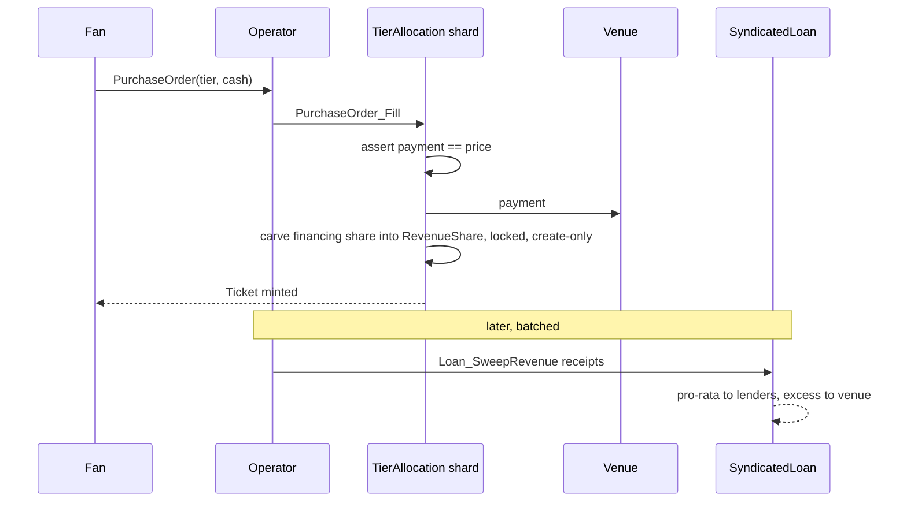
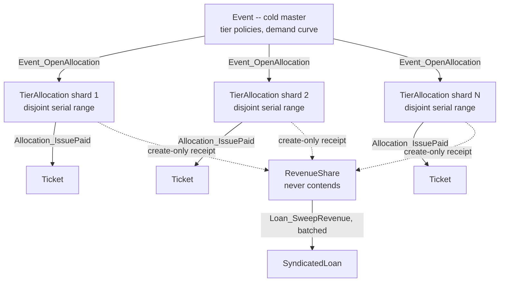

# KYD Labs on Canton — TICKS + TIX rebuild (DAML)

A from-scratch rebuild of KYD Labs' on-chain ticketing and financing stack,
migrated from **Solana** to **Canton / DAML**. This package models the two
things KYD actually runs today:

1. **TICKS** — tickets as real-world assets (RWAs) with built-in anti-scalping
   price caps and artist royalties, settled atomically against cash.
2. **TIX** — the DeFi financing layer where a venue raises upfront capital
   against future ticket revenue and a lender is repaid as sales settle.

It builds (LF 1.17, SCU-ready) and all **35 scenarios** pass on Daml SDK
**2.10.4** — functional (incl. gifting and venue refunds), a 12-suite
adversarial security harness ([`Kyd.SecurityTest`](daml/Kyd/SecurityTest.daml)),
and 4 suites driving DvP settlement, free-of-payment transfer and lock-in-place
custody through the **real CIP-56 token-standard
interfaces** (see [ecosystem integration](#ecosystem-integration-cip-56)
below) — all warning-free, in CI on every push
([workflow](../../.github/workflows/kyd-tix.yml)). The model is engineered for
Canton's contention semantics — see [Canton engineering](#canton-engineering)
below. The security review lives in [AUDIT.md](AUDIT.md); the production
network plan in [validator/](validator/README.md) with an operational
[RUNBOOK](validator/RUNBOOK.md); a native **SwiftUI fan app** lives in
[ios/KYDFan](ios/KYDFan/README.md); [DESIGN.md](DESIGN.md) is the decision
record (every choice, its best-practice basis, and the open questions for KYD);
and [HANDOFF.md](HANDOFF.md) maps what is verified, what is scaffolded, and the
production gaps in priority order.
Operator
automation (Daml Triggers) and the HTTP/JSON + TypeScript bridge for the web app
live in [`integration/`](integration/).

```
make test     # both Daml packages + all 35 scenarios
make app      # typed bindings + web app production build
make demo     # sandbox + demo seed + JSON API + triggers
cd app && npm run dev           # the product UI (PWA-installable)
ios/KYDFan                       # native SwiftUI fan app (see its README)
```

## The product (`app/`)

KYD's value-add is UX — fans never feel the blockchain — so the repo ships the
product surface, not just the model: a React/TypeScript app (typed end-to-end
via `daml codegen js`, production build verified) with a role switcher over
one seeded world. Fans get one-tap buys (filled live by the price-aware
operator trigger), QR passes, and capped resale with the limit surfaced in the
form and enforced on the ledger; the venue gets a door scanner where
double-check-in is impossible (consuming choice) and a dashboard with
demand-curve inventory control, the TIX register and pending escrows; the
artist watches royalties accrue from every resale. Architecture notes — why
the catalog reads via the operator while every action signs as the fan, and
why "no wallets" is the hosted-party model, not a hack — in
[app/README.md](app/README.md). The operator credential itself lives
server-side only ([server/README.md](server/README.md)): real RS256-signed
login tokens, a proxied catalog read, and a mint path gated by webhook
signature verification — the browser never holds operator authority.

---

## What KYD Labs runs on Solana (research)

KYD Labs is the largest on-chain ticketing company — clients include Robert
Plant, Charli XCX and Travis Scott, ~150k fans/month. The important finding for
a migration is that **they already abandoned NFT ticketing**:

- **Old model:** tickets were Solana **compressed NFTs (cNFTs)**. NFT-era
  anti-scalping and royalty enforcement proved easy to bypass and addressed the
  wrong economic problem.
- **Current model — TICKS:** tickets are **programmable financial primitives /
  RWAs**, not collectibles. All existing tickets were migrated off cNFTs onto
  the TICKS standard.
- **TIX:** an on-chain **settlement + financing layer**. Venues/artists borrow
  against future ticket sales; DeFi lenders fund and earn yield; smart-contract
  settlement is near-instant. ~$8M ticket sales and ~$2M venue financing so far;
  Solana mainnet launch targeted mid-2026.

Core operational mechanics carried over: primary sale, **resale price caps** and
**royalties**, retained fan data / resale controls for the artist, and door
redemption.

### How the financing leg actually works (research behind `Kyd.Tix`)

- **TIX's mechanic is revenue-routed repayment**: "ticket revenue automatically
  enforces repayment of financing", raised from *multiple liquidity providers
  without exclusivity deals". Track record: 300k+ tickets, $10M+ sales, $2M+
  venue financing, zero defaults.
- **Live-event capital is revenue-based financing (RBF), not a compound-interest
  loan**: a one-time **factor rate** (typically 1.10x–1.50x) fixes the total
  repayment up front; a **revenue share** of each sale (commonly 2–15% of gross;
  much higher when secured against a single show) pays it down until the cap is
  hit. Interest only enters as a *late penalty* past maturity.
- **Syndication on DAML is production-proven**: Versana — founded by BofA, Citi,
  Credit Suisse and J.P. Morgan — runs syndicated loans on Daml/Canton (1,500+
  loans, ~$900B). Distributions follow a single **pro-rata waterfall**: every
  lender is paid simultaneously, proportional to its share.

Sources:
- [KYD Labs TICKS Protocol — Solana Compass](https://solanacompass.com/learn/breakpoint-25/nft-ticketing-doesnt-work-and-were-selling-to-ticketmaster-kyd-labs)
- [TIX emerges from stealth — Cointelegraph](https://cointelegraph.com/news/tix-defi-onchain-settlement-live-event-ticketing)
- [KYD Labs launches TIX — The Defiant](https://thedefiant.io/news/nfts-and-web3/solana-ticketing-platform-kyd-labs-launches-tix)
- [Founders launch TIX — TicketNews](https://www.ticketnews.com/2025/12/founders-kyd-labs-launch-tix/)
- [KYD Labs launches decentralised financing network — Music Ally](https://musically.com/2025/12/12/kyd-labs-launches-decentralised-financing-network-for-live-events/)
- [TIX Protocol launches Solana-based financing network — Yellow](https://yellow.com/news/tix-protocol-launches-solana-based-financing-network-for-live-events-industry)
- [Revenue-based financing: terms & mechanics — re:cap](https://www.re-cap.com/financing-instruments/revenue-based-financing)
- [How RBF repayment works — Crestmont Capital](https://www.crestmontcapital.com/blog/how-revenue-based-financing-repayment-works)
- [Versana: syndicated loans on Daml/Canton — Ledger Insights](https://www.ledgerinsights.com/syndicated-loans-smart-contracts/)

---

## Why Canton/DAML is the right target

The reasons KYD's NFT enforcement leaked on Solana are exactly what Canton fixes
at the protocol level, rather than in front-end conventions:

| KYD requirement | Solana / NFT reality | Canton / DAML primitive |
| --- | --- | --- |
| Resale price cap can't be bypassed | Marketplace can ignore on-chain metadata; OTC transfers route around royalties | Transfer is a **`choice` on the asset** — the cap is a precondition; there is no "raw transfer" instruction to bypass |
| Royalty always paid | Royalties are honored only by cooperating marketplaces | Royalty split is part of the **same atomic transaction** as the ownership change (DvP) — no settlement, no transfer |
| Fan data / resale control stays with the artist | Public ledger; anyone can index holders | **Sub-transaction privacy**: a fan is `observer` only of their own ticket; one venue never sees another's events |
| Venue financing on real cash flows | Needs a separate lending protocol + oracle | `FinancingRequest` → `Loan` are signed contracts whose cash legs are atomic and visible to exactly the 3 counterparties |
| No oversell | Mint guarded by program logic | Authoritative `issued` counter on the `Event`; `ensure` clause makes oversell unrepresentable |

DAML patterns used: **propose/accept** (onboarding, resale), **lock-by-archiving**
(a listed ticket can't be double-offered), **atomic DvP**, **contract keys**
(unique `(operator, eventId, serial)`), and **signatory/observer privacy**.

---

## Contract model

| Module | Templates | Solana equivalent |
| --- | --- | --- |
| `Kyd.Roles` | `Invitation`, `Membership` | PDAs / signer allow-lists |
| `Kyd.Cash` | `Cash` (CIP-56 `Holding` + locks) | USDC SPL token (here: operator IOU, wallet-visible via the token standard) |
| `Kyd.Event` | `Event` (cold master), `TierAllocation` (hot shards), `PurchaseOrder` | Event/collection program + mint authority + the sales engine |
| `Kyd.Ticket` | `Ticket`, `ResaleOffer`, `DvPResaleOffer`, `RoyaltyAccount` | The TICKS asset + two settlement rails (cash, CIP-56 allocations) |
| `Kyd.Registry` | `KydTransferFactory`, `KydAllocationFactory`, `KydAllocation` | The CIP-56 registry over `Cash`: standard transfer/allocation factories (Canton Coin's Amulet architecture) |
| `splice-token-standard/` | vendored `Splice.Api.Token.{MetadataV1,HoldingV1,AllocationV1}` | The CIP-56 interfaces (separate package, as SCU requires) |
| `Kyd.Settlement` | `RevenueShare` | Escrowed financing carve-outs (contention decoupling) |
| `Kyd.Tix` | `FinancingOffering`, `OpenOfferingListing` + private `OpenCommitment`, `SyndicatedLoan`, `TrancheOffer` | The TIX financing/settlement program: invited + open-book raises, batch sweep, tranche secondary market |
| `Kyd.Triggers` | `autoFillOrders`, `sweepRevenue`, `accrueLateInterest` | Operator automation (off-ledger Daml Triggers) — see `integration/` |

### Lifecycle

```
operator --Invitation--> venue/artist/fan/lender        (onboarding)
venue+artist+operator: create Event                      (cold master: tier policies)
Event_OpenAllocation(tier, size) --> TierAllocation      (hot shard @ demand-curve step)
TierAllocation.Allocation_Issue --> Ticket               (comps/door sales)
fan: PurchaseOrder(tier) --Fill(operator, shard)-->      (paid primary sale, atomic:)
    payment == shard price
    venue's portion -> venue
    financing share -> escrowed RevenueShare receipt     (create-only: no loan contention)
    Ticket -> fan  [resale cap = paid price x capBps]
operator: Loan_SweepRevenue([receipts])                  (batch: one loan write per sweep)
    share --> lenders pro-rata; excess -> venue; loan retired at zero
Event_SetTierBasePrice / Allocation_Reprice              (manual dynamic pricing)
Ticket.Ticket_Offer --> ResaleOffer  [price <= cap]      (locks the ticket)
ResaleOffer.Accept(cash):                                (atomic DvP)
    royalty  -> artist
    proceeds -> seller
    ticket   -> buyer
Ticket.Ticket_CheckIn -> redeemed (resale now blocked)   (door scan)

venue+operator: FinancingOffering (invited lenders)      (TIX: targeted raise)
              | OpenOfferingListing (public: terms only)   (TIX: open order book)
Offering_Commit(cash) per lender --> lock-in-place        (lender keeps custody)
  open book: any lender holding a Lender membership       (KYC gate, no invite)
             reads `public` to discover and commit
  Offering_Uncommit / Offering_Cancel --> refunds        (escape hatches)
Offering_Activate [fully subscribed]:                    (atomic)
    principal -> venue
    SyndicatedLoan booked; tranche_i = commit_i x factor rate
Loan_SettleRevenue(sale cash):                           (auto-enforced repayment)
    revenue share --> lenders pro-rata; remainder -> venue
Loan_Distribute(cash) --> pro-rata waterfall             (direct paydown)
Loan_AccrueLateInterest [past dueDate]                   (simple interest / late day)
... archived when every tranche reaches zero

lender: Loan_OfferTranche --> TrancheOffer               (secondary market listing)
TrancheOffer_Accept(cash) [buyer + operator]:            (atomic DvP, KYC-gated)
    price -> seller; register: face moves seller -> buyer
```

The paid-sale leg above, as a sequence:



The paid primary sale is the piece that makes TIX's *"ticket revenue
automatically enforces repayment"* literal on Canton: at the moment of sale the
lenders' share is locked in place on the venue's own holding (the venue keeps
custody but cannot spend it) — and the sweep settles whole batches through the
loan. Commitments and revenue shares both use this lock-in-place model, so
funds never sit in operator custody outside the one atomic hop the batch
sweep needs to fan a receipt out pro rata — and even that hop requires the
venue's co-signature, live if attempted standalone (audit KYD-02, KYD-11).
The tranche market
clears through the operator (joint controller), mirroring the agent-bank role
in real syndications, and buyers must hold a `Lender` membership — an on-ledger
KYC gate for the RWA story.

### Canton engineering

This model is shaped by Canton's execution semantics, not just Daml's type
system. Per the official [contention guidance](https://docs.daml.com/daml/resource-management/contention-avoiding.html):
only one consuming choice can ever be exercised per contract, so any contract
consumed on a high-frequency path serializes that path and causes retry storms.



Solid arrows are the hot path (N parallel sales streams, no shared write);
dotted arrows are create-only (never contend); the loan is touched once per
*batch*, not once per ticket — measured below at 8.7–13.7x throughput.

**Hot-path analysis and the fixes:**

| Naive design (v1) | Problem on Canton | This model |
| --- | --- | --- |
| One `Event` contract consumed per ticket sale | A 10k-fan on-sale = 10k strictly sequential consumes of one contract | **Cold master / hot shards**: `Event_OpenAllocation` carves disjoint `TierAllocation` blocks; N open shards = N parallel sales streams (`testParallelShards`) |
| `Loan_SettleRevenue` exercised inside every fill | Every sale also consumes the loan → ALL sales serialized on one contract, sales latency coupled to financing | **Create-only receipts + batch sweep**: fills create `RevenueShare` escrows (creates never contend); `Loan_SweepRevenue` settles whole batches in one loan write (`testBatchSweep`: 5 sales, 1 sweep) |
| `lookupByKey` on the sales hot path | Key resolution adds maintainer coordination per sale; Canton [cannot enforce key uniqueness across sync domains](https://docs.daml.com/2.6.5/canton/tutorials/composability.html) | Hot path is **key-free**: fills work entirely on explicit contract ids; keys survive only on cold admin contracts (`Event` master, `Membership`, loan-by-event for the tranche market) |
| `Ticket` carried a contract key | Uniqueness checks on the hottest template, for nothing | Dropped — serial uniqueness holds **by construction** (each shard owns a disjoint serial range) |
| Global per-sale demand curve | Needs a global counter = a synchronization bottleneck (the docs' anti-pattern) | **Step curve over allocations**: each successive shard prices at `base x (1 + allocated x demandBps/10⁴)` — same economics, zero shared state between sales |

**Measured, not just argued.** A concurrent-issuance benchmark
([`integration/client/src/bench.ts`](integration/client/README.md), one
command) shows sharding deliver **8.7× at 16 concurrent issues and 13.7× at 24**
on a single-node sandbox, with per-shard contention retries dropping from 100s
to **zero** — and the speedup grows with concurrency, exactly as the model
predicts. See [`integration/`](integration/README.md#contention-benchmark-clientsrcbenchts).

**Upgrade readiness (SCU):** built with `--target=1.17` and `daml-script-lts`,
which enables [Smart Contract Upgrade](https://docs.daml.com/upgrade/smart-contract-upgrades.html)
on Canton protocol 7 — future package versions can append `Optional` fields and
choices with zero downtime and no contract migration.

**Privacy posture:** sub-transaction privacy does the segmentation (a fan sees
only their tickets; a lender only their syndicates), escrow visibility is
explicit via `Cash` disclosure (no deprecated divulgence anywhere — the test
suite runs warning-free), and the open order book uses the public-party
broadcast pattern rather than widening observers on business contracts. This
is **proven on a real two-participant Canton network** in
[`privacy-proof/`](privacy-proof/README.md) (`./run.sh`, race-free,
deterministic): both the `Cash` privacy primitive *and* the **full app** — a
competing venue and fans on a separate participant never see another venue's
events, inventory or tickets, while sharded issuance, a paid sale and a
cross-participant gift run on real Canton.

### Targeted vs. open financing (the public-party pattern)

A contract is only visible to its stakeholders, so an *open* raise needs a way
for unknown lenders to discover it. `OpenOfferingListing` is observed by a
well-known **`public`** party that every onboarded lender reads (`readAs`),
forming a public order book — the standard Canton broadcast pattern. But
discovery is split from the commitment ledger (audit KYD-09): the public
listing carries only the **terms and the aggregate `raised`**, while each
lender's commitment is a separate, private `OpenCommitment` visible only to the
operator, venue and that lender — so the book never leaks *who* committed or
*how much*. Eligibility moves from an invite list to **on-ledger credentials**:
`Listing_Commit` looks up the committer's `Lender` membership (`Kyd.Roles`) as a
KYC gate. Both paths converge on the same `SyndicatedLoan`, so settlement, the
waterfall and the tranche market are identical downstream.

### TIX worked example (from `testSyndicatedFinancing`)

Target 1,000 at a **1.10x factor rate**, **50% revenue share**, 10bps/day late
interest. Lender A commits 600, lender B 400 (escrowed; refundable until
activation). On activation the venue receives 1,000 and owes A 660 / B 440.
A 200 ticket sale settles through the loan: 100 is carved out pro-rata
(A 60 / B 40) before the venue touches the rest. A direct 500 paydown splits
A 300 / B 200. Ten days past maturity, outstanding accrues 1% (A 303 / B 202),
and a final 505 payment retires the loan — every leg atomic, every split exact.

### Tiered seating + dynamic pricing

Events are organised into tiers (GA / VIP / …), each with its own supply, base
price and resale-cap policy, carved into fixed-price allocations for sale. Two
anti-scalping levers from KYD's playbook are encoded as contract law:

- **On-ledger demand curve**: each successive allocation of a tier prices one
  step higher (`demandBps` of base per ticket already allocated) — a
  deterministic, auditable step function, with no oracle and no shared counter
  between concurrent sales. Fills reject payments at any other price, so a fan
  is never charged a price they didn't sign for, and bots can't bulk-buy at a
  stale price. The venue or the artist can also reprice a tier's base
  (`Event_SetTierBasePrice`) or an open shard (`Allocation_Reprice`).
- **Resale cap anchored to the price actually paid** (`resaleCapBps` x
  purchase price), not one event-wide number — a fan who paid 51 on the curve
  can resell at up to 76.5 (1.5x), and not a cent more.

### Worked example (from `testResaleWithRoyalty`)

Face 50, resale cap 75, royalty 10%. Alice resells to Bob at **70**:
royalty **7 → artist**, **63 → Alice**, ticket **→ Bob** — one transaction, all
or nothing. An offer at 100 is rejected by the cap (`testResaleCapEnforced`); a
checked-in ticket can't be resold (`testRedeemedCannotResell`).

---

## Tests

`daml test` runs:

1. `testOnboarding` — propose/accept membership handshake
2. `testPrimarySale` — mint to fan, issued-counter advances
3. `testResaleWithRoyalty` — atomic royalty + proceeds + ownership
4. `testResaleCapEnforced` — anti-scalping cap rejects over-cap offers
5. `testRedeemedCannotResell` — redeemed tickets are non-transferable
6. `testSyndicatedFinancing` — two-lender raise: escrowed commitments, guards
   (uninvited / double / over-commit, premature activation), atomic activation,
   revenue-share settlement, pro-rata distribution, late-interest accrual,
   full payoff
7. `testOfferingCancelAndUncommit` — lender withdrawal and venue cancellation
   both refund escrow in full
8. `testPaidPrimarySaleRoutesRevenue` — a fan's purchase order fills atomically:
   payment to the venue, financing share into an escrowed receipt (loan
   untouched on the hot path), ticket minted; underpayment cannot fill; the
   sweep then settles the receipt pro-rata
9. `testTrancheSecondaryTrading` — tranche sold at a discount via atomic DvP;
   over-listing and non-KYC'd buyers rejected; the buyer participates pro-rata
   in subsequent distributions
10. `testTieredDynamicPricing` — successive GA shards price 50 → 51 → 52 on the
    step curve (stale prices rejected) while VIP stays flat; per-purchase
    resale caps; supply enforced at the master; shard repricing by the artist;
    unauthorized repricing rejected
11. `testOpenOrderBook` — non-invited raise broadcast to the public party;
    onboarded lenders discover and commit via `readAs public`; non-onboarded
    party rejected at the KYC gate; converts to the same syndicated loan
12. `testParallelShards` — two shards of one tier sell independently (no
    write-write contention) with disjoint serial ranges by construction
13. `testBatchSweep` — five sales → five create-only receipts → ONE consuming
    sweep on the loan; over-collection retires the loan and refunds the excess
14. `testReceiptRefund` — with no facility owed, operator+venue jointly refund
    an escrowed share to the venue

**Token-standard suite** (`Kyd.TokenTest`, driven through the real
`Kyd.Registry` factories): `testCip56DvPResale` — full DvP via the
`AllocationFactory`/`Allocation` interface (two legs + ticket, one
transaction); `testCip56LegValidation` — short legs, foreign settlement
references, third-party-funded legs and missing royalty legs all rejected;
`testCip56Transfer` — free-of-payment transfer via the standard
`TransferFactory`; `testCip56LockReservation` — an allocated holding is locked
in place (still owned, unspendable) until it settles or is withdrawn.

**Adversarial suite** (`Kyd.SecurityTest`, every scenario an attack that must
fail): forged cash issuance and theft, overdrafts, authority abuse on
issuance/repricing/fills, unilateral escrow refunds, an operator freezing or
redirecting locked funds to itself (audit KYD-11), register tampering by the
operator (audit KYD-01), cross-facility receipt injection, resale
double-listing and impersonation, membership forgery. Findings and trust model
in [AUDIT.md](AUDIT.md).

---

## Automation & integration (`integration/`)

- **Daml Triggers** (`Kyd.Triggers`): `autoFillOrders` settles fan purchase
  orders and load-balances them across open shards; `sweepRevenue` batches
  escrowed receipts through each loan every few minutes (one loan write per
  sweep); `accrueLateInterest` runs daily accrual on overdue loans. All three
  compile into the DAR and are listed by the trigger runner.
- **JSON API + daml2js**: `integration/codegen.sh` generates typed TS bindings
  (`@kyd/kyd-tix-0.1.0`) for the web app; `integration/client/` shows a fan
  buying a ticket over HTTP; `integration/run-local.sh` boots the full stack.

## Ecosystem integration (CIP-56)

**Why this integration and not another:** the highest-volume Canton activity
(e.g. [Broadridge DLR's ~$8T/month repo flows](https://messari.io/report/understanding-canton-network-a-comprehensive-overview))
runs on *private* synchronizers — not integrable. The highest-usage
*integrable* surfaces on the Global Synchronizer are **Canton Coin** (the
network's native payment app, with network activity of
[600k–1M+ daily transactions](https://coinstats.app/ai/a/investment-analysis-canton-network))
and **[USDCx](https://www.canton.network/blog/usdcx-now-live-on-canton-unlocking-private-and-composable-usdc-backed-settlement)**
(Circle xReserve-backed, already used in live on-chain repo settlement, with
[BitGo qualified custody](https://www.bitgo.com/resources/blog/bitgo-extends-canton-support-to-the-cip-56-token-standard/)).
Both — and every other major Canton asset — speak the
**[CIP-56 token standard](https://www.canton.network/blog/what-is-cip-56-a-guide-to-cantons-token-standard)**.
So the one integration that composes with all of them is the standard itself:

- **`Kyd.Cash` is a full token-standard asset, not a Holding stub.** It
  implements the `Holding` interface (including holding-level **locks**), and
  `Kyd.Registry` publishes the standard **`TransferFactory`** and
  **`AllocationFactory`** that operate on it — exactly Canton Coin's Amulet
  architecture, where the asset implements `Holding` and the registry app
  provides the factories wallets fetch. Every CIP-56 wallet (Loop, Canton Coin
  wallets) discovers and displays balances via an `InterfaceFilter` on
  `Splice.Api.Token.HoldingV1:Holding`, no KYD-specific wallet code.
- **Allocations lock funds in place** — like Amulet, the registry reserves a
  holding by locking it where it sits (custody stays with the owner; the
  operator holds the lock) rather than taking custody. Settlement unlocks and
  pays the receiver; withdrawal releases the lock back. A locked holding is
  unspendable and excluded from spendable balance (`testCip56LockReservation`).
- **Ticket resale settles via the `Allocation` API** (`Ticket_OfferDvP` →
  `DvPResaleOffer`): the buyer's wallet calls the `AllocationFactory` to fund
  two standard legs (seller proceeds + artist royalty), and settlement executes
  both allocations and the ticket transfer in **one atomic transaction**, in
  **any CIP-56 asset — Canton Coin, USDCx, cBTC**. The settlement code speaks
  only the interface, so no code changes per asset.
- **The royalty leg is the subtle part**: executing an allocation requires the
  *receiver's* authority, and the artist doesn't sign resale offers. The
  artist's standing `RoyaltyAccount` (signed once at onboarding) lends that
  authority to settlements through its choice — a worked example of Daml's
  authority-propagation rules.
- The interfaces are **vendored unmodified** from
  [hyperledger-labs/splice](https://github.com/hyperledger-labs/splice)
  (Apache-2.0) as a **separate package** — the SCU checker itself enforces
  that interfaces and implementations must not share a package. On-network
  deployments swap the vendored DAR for the official `splice-api-token-*-v1`
  releases (one `daml.yaml` line) so package ids match what Canton Coin and
  USDCx implement. `Kyd.Registry` is a real registry over `Cash` (factories +
  lock-in-place allocations) so `daml test` drives the whole rail through the
  standard factories and `Allocation` interface — the same calls a wallet makes
  against Canton Coin.

## Canton Network deployment (`validator/`)

[validator/README.md](validator/README.md) is the production plan: running the
KYD validator node against the Global Synchronizer (DevNet → TestNet →
MainNet sponsorship), the **Featured Application** path (⅔ SV vote →
`FeaturedAppRight` → activity markers → `AppRewardCoupon` → Canton Coin),
the post-April-2026 incentive economics (usage-based rewards, 62% app pool
until mid-2029 — at volume, Featured App rewards exceed traffic fees), and
the **CIP-56 token standard** swap that replaces `Kyd.Cash` with registry-
custodied holdings/allocations (retiring audit finding KYD-02).

## Not in scope (next steps)

- Vendoring the splice amulet DARs to emit `FeaturedAppActivityMarker`s from
  the trigger submissions (deployment wiring; mapped in `validator/README.md`).
- Production swap of `Kyd.Cash` for Canton Coin / USDCx (a `Kyd.Registry`
  dependency change — all settlement already speaks the CIP-56 interfaces).
- Tiered seating maps / seat-level inventory (today tiers are fungible pools).
