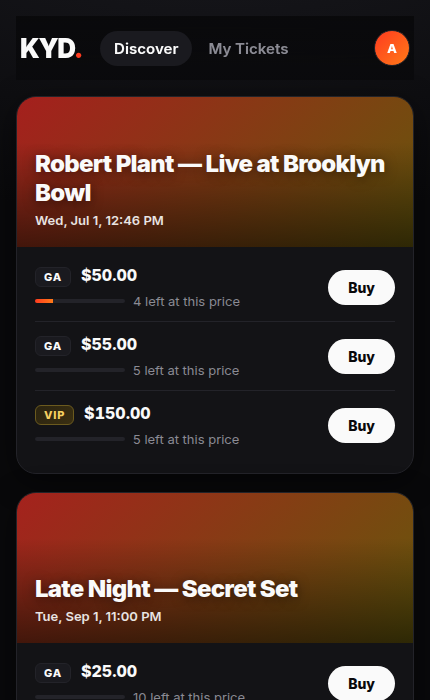
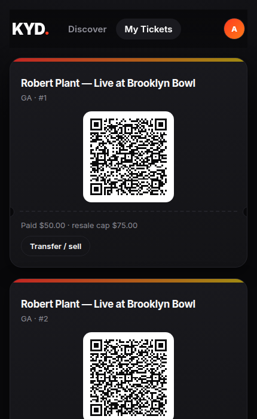
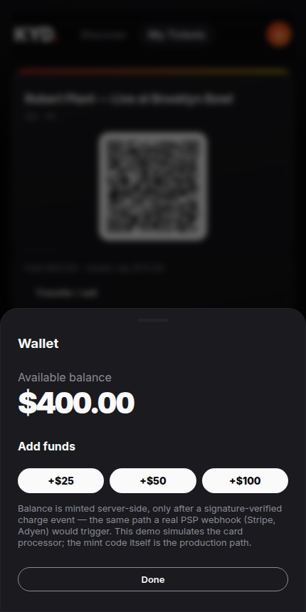

# KYD web app — the product on top of the ledger

KYD's value-add is that fans never feel the blockchain: tap a show, pay,
get a QR pass, sell it on (capped) if plans change. This app is that product
surface over the Daml model — React + TypeScript, typed end-to-end with
`daml codegen js` bindings, talking to the HTTP JSON API.

```
integration/run-local.sh      # sandbox + demo seed + JSON API + server + triggers
cd app
npm run codegen               # typed bindings from the built DAR
npm install
npm run dev                   # http://localhost:5173
```

| Discover | My Tickets | Wallet |
| --- | --- | --- |
|  |  |  |

Screenshots are the production build (`npm run build && npm run preview`)
against a real running stack — the full gallery, including the venue and
artist roles, is in the [top-level README](../README.md#the-product-app).

## What the demo shows

Switch roles in the header — each role acts under its OWN party's authority:

- **Alice / Bob (fans)** — *Discover*: live price levels straight from the
  open `TierAllocation` shards (watch GA step 50 → 55 as levels sell);
  one-tap Buy signs a `PurchaseOrder` and the operator's trigger fills it —
  the pass appears in *My Tickets* when the atomic fill commits. *My
  Tickets*: QR passes (the QR is the contract id — one valid copy, ever),
  resale with the anti-scalping cap as a hard limit in the form AND on the
  ledger, incoming offers to accept/decline.
- **Brooklyn Bowl (venue)** — *Door*: the manifest per show; Check in
  exercises the consuming choice, so double-scans are impossible. *Dashboard*:
  inventory per tier with the next demand-curve price, one-click "open 5
  more" at the current curve step, the TIX register (per-lender outstanding)
  and pending revenue-share escrows the venue cannot touch.
- **Robert Plant (artist)** — *Royalties*: the balance that accrues
  automatically from every capped resale, plus per-show fan visibility (the
  artist signs the event, so fan data is theirs by construction).

## UX-architecture notes (the part that matters)

- **No wallets anywhere.** Fan parties are hosted on the operator's validator;
  "login" is an identity pick here — `POST /auth/login` against `../server`
  (`useSession` in `api.ts`) — that in production becomes a phone/email/OIDC
  login in front of the same real, RS256-signed token issuance (see
  `server/README.md`). Money is a balance; the note-splitting plumbing
  (`exactNote`) lives in `api.ts` and never reaches a component.
- **Catalog vs. authority.** Fans are not stakeholders of `Event` /
  `TierAllocation` (privacy by default), so the catalog is read through the
  operator — exactly the backend-API role KYD's web2 app plays today. That
  operator session lives in `../server` now, not the browser: the app calls
  `GET /catalog` (`useCatalog` in `api.ts`) and gets plain JSON back, never a
  token. Every *action* (buy, resell, accept) is still signed by the fan's
  own party, using the token `/auth/login` issued for that role.
- **The automation IS the UX.** Buying feels instant because the
  price-aware `autoFillOrders` trigger races the UI's 2s poll; nothing in the
  front end ever holds operator authority — literally: there is no code path
  left in `api.ts` that constructs a token for any party but the one
  currently logged in.
- Session tokens are real (RS256, signature-verified against a published
  JWKS), minted by `../server`; production points that server's identity
  step at a real OAuth2/OIDC provider instead of the demo's role picker.
