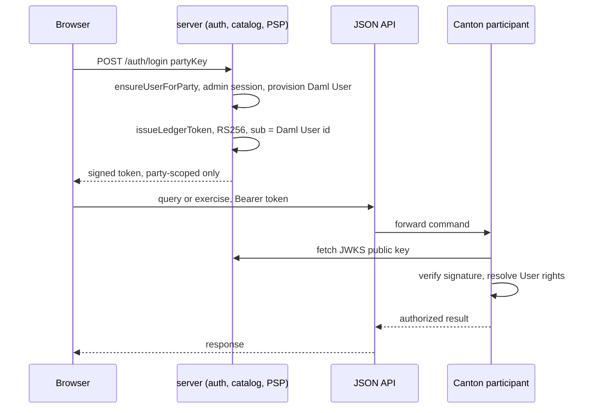

# server — the custody boundary in front of the ledger

Closes HANDOFF.md's production gaps #1 (auth), #3 (catalog service) and #4
(PSP on-ramp) with real code, not a plan: this is the one place an operator
credential exists, and it never crosses into the browser.



Everything left of the JSON API is this server's problem, not the browser's:
the operator credential, the admin session, the Daml User provisioning step —
none of it is a shape the browser can ever hold.

## What changed

Before this package, the web app (`app/`) held an operator-scoped Ledger
token directly, self-minted client-side and unsigned (`sandboxToken` in the
old `app/src/api.ts`) — good enough to talk to a local, unauthenticated
sandbox, but a real credential nonetheless: anyone who could read the
browser's JS could mint their own copy asserting `actAs: [operator]` and do
anything the operator can do (comp tickets, move commitments, mint Cash —
see AUDIT.md's KYD-11 for the ledger-side half of this exact problem).

Now:

- **Auth is real.** `POST /auth/login` exchanges a demo role for an
  RS256-signed, short-lived (15 min) token this server mints
  (`src/tokens.ts`, `src/identity.ts`). The signing key never leaves the
  server; `GET /.well-known/jwks.json` publishes only the public half
  (`src/keys.ts`, `src/jwks.ts`). A browser holding one of these tokens
  cannot mint another — it never had the private key.
- **Tokens carry a real Daml identity, not just a claim.** `src/userManagement.ts`
  provisions (idempotently) a Daml `User` for each logging-in party, granted
  `CanActAs`/`CanReadAs` for exactly that party, via a short-lived
  admin-scoped session — because a real Canton participant resolves a
  token's `sub` through its own User Management unconditionally; a token's
  own `actAs`/`readAs` claims aren't sufficient on their own (found live,
  see `auth-proof/` below).
- **The operator credential lives here, and only here.** `LedgerSession`
  (`src/ledgerSession.ts`) mints its own tokens on the operator's behalf and
  talks to the JSON API directly, provisioning its own Daml User the same
  way. `identity.ts`'s `loginable` map is built *without* the operator —
  `/auth/login` can never hand a browser one of its tokens, no matter what
  it's asked for.
- **Catalog reads are proxied**, not client-held. `GET /catalog`
  (`src/catalog.ts`) runs the events/allocations query under the operator
  session and returns plain JSON — the browser gets data, never a
  credential.
- **Minting only ever happens after a verified PSP signature.**
  `processPspWebhook` (`src/psp.ts`) is the one function that creates `Cash`;
  it requires a valid HMAC-SHA256 signature over the exact request bytes
  (Stripe/Adyen-style) before it will touch the ledger. `POST /webhooks/psp`
  (`src/webhook.ts`) is the real external route a PSP would call. This demo
  has no real card processor to round-trip through, so `POST
  /payments/topup` (`src/payments.ts`, gated by the FAN's own session token)
  synthesizes the exact signed event a real PSP would send and runs it
  through the identical `processPspWebhook` — there is no second, weaker
  mint path for the demo case.

## Run it

`../integration/run-local.sh` starts this automatically as step 4. Standalone:

```
npm install
DEMO_PARTIES_PATH=../app/public/demo-parties.json npm run dev   # :4001
```

## Test it

```
npm test
```

58 tests, no ledger required: token issuance/verification round-trips
(including a genuine HTTP fetch of `/.well-known/jwks.json` against a live
server in `test/jwks.test.ts` — the same fetch-and-verify a real relying
party performs), signing-key persistence across process restarts, Daml User
provisioning (create, then idempotent grant-fallback if the user already
exists), the auth route's operator exclusion, HMAC signature accept/reject
on the webhook route, PSP delivery idempotency (a replayed signed body
mints exactly once), the catalog proxy, and the data plane added for
production: SQLite migrations and the narrow `KydDb` surface (`src/db.ts`),
the ACS poll-and-diff indexer's baseline/transition/archival semantics
(`src/indexer.ts`), the notifications and analytics routes' auth and
validation, and `/healthz` + `/metrics`. The full HTTP surface is specified
in [`openapi.yaml`](openapi.yaml); the architecture it serves is
[`../PRODUCTION.md`](../PRODUCTION.md).

## What's proven vs. documented

Beyond the unit suite, this was driven end to end against a real running
sandbox + JSON API + this server (`integration/run-local.sh`'s exact stack):
login as a seeded role, query the real JSON API with the issued token,
read the catalog proxy, top up through the fan's own session, and — the
adversarial case — hit the raw webhook route with a forged and then a
missing signature and confirm both are rejected (401) with the ledger
balance provably unchanged before/after. This is also what caught two real
bugs unit tests alone hadn't: the JSON API's classic `/v1/query` rejects
bare `<module>:<entity>` template-id strings (needs the `#<package-name>`
or full-hash form — fixed by routing `LedgerSession` through the same typed
`@daml/ledger` client the web app uses, not hand-rolled strings), and
Express 4 doesn't catch a rejected promise from an async handler — a ledger
client bug took the whole process down mid-request until every route that
touches the ledger was wrapped in `asyncRoute.ts`.

| Claim | Status |
| --- | --- |
| Tokens are RS256-signed and verify against the published JWKS | **Proven** — `test/tokens.test.ts`, `test/jwks.test.ts` (real HTTP fetch), and the live run above |
| `/auth/login` can never issue an operator-scoped token | **Proven** — `test/auth.test.ts`, and a live `403` on `{"partyKey":"operator"}` |
| A mint only ever happens behind a verified HMAC signature | **Proven** — `test/psp.test.ts`, and live: a forged and a missing signature both rejected (401) against the real webhook route with the ledger balance unchanged |
| Top-up mints exactly the requested amount into the fan's own balance | **Proven live** — real JSON API query before/after showed the balance move from one $500 note to $500 + $77 |
| The catalog proxy returns real ledger data with no credential in the response | **Proven live** — the seeded 2 events / 4 allocations, as plain JSON |
| A ledger-side failure degrades to a 502, not a crashed process | **Proven live** (see the bug note above) — `asyncRoute.ts` + `test/psp.test.ts`, `test/catalog.test.ts` |
| The browser never holds an operator-scoped ledger token | **Proven** — `app/src/api.ts` has no path left that constructs one; `catalog`/`topUp` go through this server |
| The signing key survives a process restart / is shared across processes (`SIGNING_KEY_PATH`) | **Proven** — `test/keys.test.ts` (deterministic RFC 7638 thumbprint `kid`, so two separate process invocations loading the same persisted key agree without coordinating) |
| Daml User provisioning is idempotent (create, or grant if already exists) | **Proven** — `test/userManagement.test.ts` |
| **Canton's own ledger-api verifies these tokens' signatures AND authorizes a real fan login, end to end** | **Proven live** — `auth-proof/` (`./run.sh`, ~30-60s). See below. |

### What the live proof actually does, and what it found along the way

`auth-proof/run.sh` boots a real, single-participant Canton configured with
a `jwt-rs-256-jwks` auth-service pointed at this server's own
`/.well-known/jwks.json`, then checks six real Canton verdicts — not
app-level ones:

1. A legitimate admin token (`sub=participant_admin`) — **accepted** for a
   real ledger call.
2. A token forged with a *different* signing key — **rejected**.
3. A bit-flipped copy of a real token — **rejected**.
4. No token at all — **rejected**.
5. A validly-signed token naming an unprovisioned `sub` — **rejected**.
6. **A genuine fan login through this server's own `/auth/login`,
   presented to the real ledger-api for an ordinary `/v1/query` — accepted.**

Step 6 is the thing that mattered and, on the first pass, didn't work: this
Daml SDK's participant resolves **every** token's `sub` through Canton's own
User Management, unconditionally — a token carrying an explicit
`actAs`/`readAs` claims blob (what `tokens.ts` always issued) was rejected
with `UserNotFound` unless `sub` named a Daml `User` actually granted
`CanActAs`/`CanReadAs` rights. There is no legacy bypass for this on the
participant config tested here. `src/userManagement.ts` closes it:
`ensureUserForParty` provisions that `User` (idempotently, via a
short-lived admin session, same custody-boundary principle as the operator
credential) the moment a party first logs in, and `identity.ts`/
`ledgerSession.ts` set `sub` to that user's id instead of the raw party
string.

A second, smaller thing the live run caught: `tokens.ts`'s `ledgerId` claim
was hardcoded to `"sandbox"` — correct for `daml sandbox` (why it went
unnoticed), wrong for any real Canton participant, which defaults its
ledger id to its own node name. `LEDGER_ID` is now an env var
(`auth-proof/run.sh` sets it to `p1`, matching `canton.conf`).

### Running the live proof

```
cd server/auth-proof
./run.sh
```

Standalone (assumes ports 4001/6041/6042/6048/6049/7576 are free — don't run
alongside `integration/run-local.sh`, which also uses `:4001`). Boots a real
Canton participant with `canton.conf`'s `jwt-rs-256-jwks` auth-service:

```hocon
canton.participants.<name>.ledger-api.auth-services = [{
  type = jwt-rs-256-jwks
  url = "http://localhost:4001/.well-known/jwks.json"
  target-audience = "https://kyd-tix-ledger/"   # must match tokens.ts's AUDIENCE
}]
```

### What's still not wired

Wiring the same `auth-services` config into `integration/run-local.sh`'s
plain `daml sandbox` (which manages its own opaque participant config, not
a hand-authored `canton.conf`) is still open — that would need the same
raw-`canton.jar daemon -c canton.conf` approach `privacy-proof/` and
`auth-proof/` already use for topology control, applied to the actual demo
stack. A real IdP behind `/auth/login` in place of the demo's role picker,
and TLS everywhere, are also still open. None of these are config lines;
they're real, scoped work, called out rather than claimed — the same
standard this repo holds the CIP-56 official-package swap to (see
`HANDOFF.md`).
